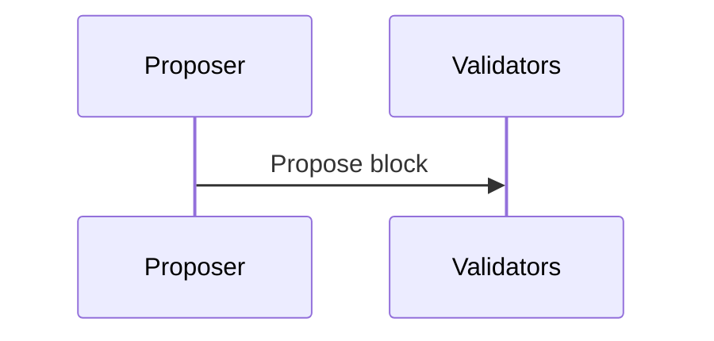

# Documentation Formatting Guide

Formatting conventions for all Mononium project documentation.

## File Naming

| Doc type              | Pattern                        | Example                      |
| --------------------- | ------------------------------ | ---------------------------- |
| ADRs                  | `ADR-NNN-kebab-title.md`       | `ADR-007-database.md`        |
| Plan docs             | `PascalCase.md`                | `Consensus.md`, `Storage.md` |
| Reference / guides    | `kebab-case.md`                | `formatting.md`              |
| Version folders       | `V{semver}/`                   | `V0.1.0/`                    |
| DOX / AGENTS.md       | `AGENTS.md` (exact, no prefix) | `docs/plans/AGENTS.md`       |

ADR files are zero-padded to 3 digits (`ADR-001`, `ADR-015`).

## Frontmatter

YAML frontmatter between `---` delimiters, placed at the top of the file:

```yaml
---
tags: [consensus, protocol, validators]
---
```

Use tags for topical grouping. Common tags: `design`, `system`, `crypto`, `network`, `storage`, `consensus`, `protocol`, `validators`.

## Headings

- `#` — document title (one per file)
- `##` — major section
- `###` — subsection
- `####` — sub-subsection (rare)

Leave one blank line before and after each heading. No trailing punctuation in headings.

```markdown
# Consensus

## Eras

An era is the period between validator set recalculations.

### Era 0 (Bootstrap)

Era 0 has no stake requirement.
```

## Links

Use standard markdown relative links (no Obsidian wikilinks):

```markdown
[Philosophy](Philosophy.md)
[Validators](Validators.md#Validator Election)
[ADR-007](architecture/ADR-007-database.md)
```

- Same-directory links: `[text](target.md)`
- Cross-directory links: `[text](../target.md)`
- Anchors: `[text](target.md#Anchor Name)` — use the heading text as-is (spaces OK)
- ADR references from plan docs: `[ADR-007](architecture/ADR-007-database.md)`

## Code Blocks

Always specify the language when applicable:

````markdown
```rust
pub struct MempoolConfig {
    pub max_size: usize,
}
```



```json
{"key": "value"}
```

```text
File tree or plain output
```
````

| Content               | Language tag      |
| --------------------- | ----------------- |
| Rust code             | `rust`            |
| Mermaid diagrams      | `mermaid`         |
| JSON                  | `json`            |
| File trees / sketches | (none / `text`)   |
| Config / pseudo-code  | (none)            |

## Tables

Use aligned dashes and pipe delimiters. Short dashes row, pipes at both ends:

```markdown
| Parameter   | Value | Notes            |
| ----------- | ----- | ---------------- |
| Block time  | 5s    | Fixed            |
| Block size  | 500 KB| Hard cap         |
```

Tables with 3+ columns should wrap headers to keep scanability. Right-align numeric columns when useful (rare — plain left is the default).

## Mermaid Diagrams

Use fenced code blocks with `mermaid` tag:

````markdown
```mermaid
graph TD
    A[title] --> B

sequenceDiagram
    A->>B: message
```
````

- `graph TD` for top-down architecture / dependency diagrams
- `graph LR` for left-right flow diagrams
- `sequenceDiagram` for protocol flows
- Keep diagrams simple — extract complex ones into separate docs
- No wikilinks inside diagram blocks (Mermaid `[[node]]` syntax is a styled node, not a link)

## Emphasis

| Style       | Usage                       |
| ----------- | --------------------------- |
| `**bold**`  | Key terms, important values |
| `` `code` `` | Types, variables, file paths, inline commands |
| `_italic_`  | Rare — emphasis only        |

Do not use `__underscore__` for bold or `*asterisk*` for italic.

## Lists

Unordered lists use hyphens:

```markdown
- Item one
- Item two
- Item three
```

Ordered lists use numbers:

```markdown
1. First step
2. Second step
3. Third step
```

Nested lists indent 2 spaces:

```markdown
- Parent item
  - Child item
  - Child item
- Parent item
```

## Horizontal Rules

`---` between unrelated sections. One blank line before and after.

## Blockquotes

> For callouts, next-step pointers, or emphasis of important context:

```markdown
> **Next:** Start with Philosophy to understand the design rationale.
```

## Comments

HTML comments for notes that should not render:

```markdown
<!-- TODO: add section on slashing when designed -->
```

## DOX Conventions

AGENTS.md files follow a fixed section order:

```
# DOX: scope/

## Purpose
## Ownership
## Local Contracts
## Work Guidance
## Verification
## Child DOX Index
```

See `AGENTS.md` files at project root, `docs/AGENTS.md`, `docs/architecture/AGENTS.md`, and `docs/plans/AGENTS.md` for actual examples.

## Spacing

- One blank line between sections
- One blank line before and after code blocks, tables, horizontal rules
- No trailing whitespace
- One line between list items (for readability in source)
- No blank lines inside list items (keep them together)

## General Style

- Keep docs concise, current, and operational
- Prefer active voice
- Use Monium (MONEX) as the token name
- Write for developers who know blockchain concepts
- Link to ADRs when decisions are referenced
- Avoid repeating information that exists in ADRs — cross-reference instead
