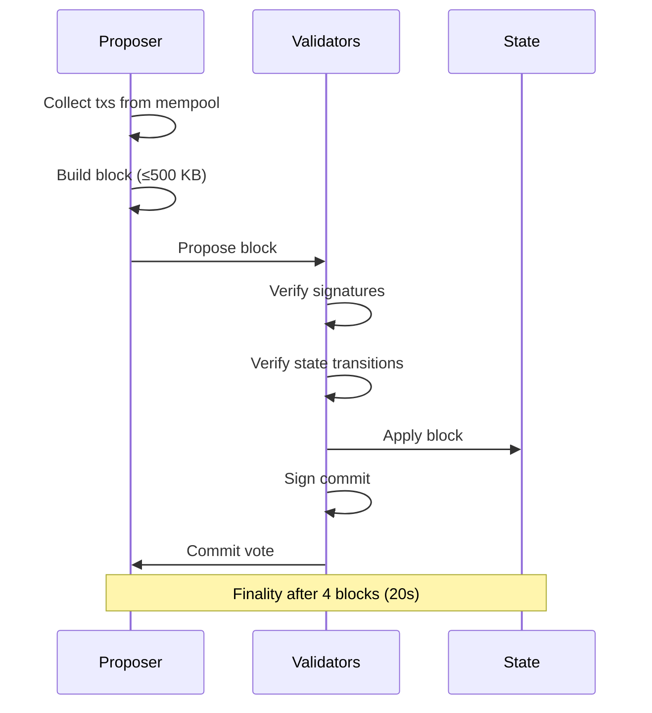

# Consensus

## Overview

Proof of Stake consensus with a fixed 5-second block time and 20-second finality.

## Parameters

| Parameter          | Value          | Notes                              |
| ------------------ | -------------- | ---------------------------------- |
| Type               | PoS            |                                    |
| Block time         | 5s             | Fixed, not variable                |
| Finality           | 20s            | 4 blocks of no reorg               |
| Block size         | 500 KB         | Hard cap                           |
| Finality mechanism | To be designed | Likely PBFT-style or pipelined BFT |

## Flow



## Throughput

TPS is not a fixed target — it emerges from:

```
TPS ≈ block size / avg tx size / block time
```

With 500 KB blocks, 5s block time, and typical tx sizes:

| Tx Size | TPS (approx) |
| ------- | ------------ |
| 100 B   | ~1,000       |
| 250 B   | ~400         |
| 500 B   | ~200         |
| 1 KB    | ~100         |

## Validator Rotation

Validator set rotates via staking. Active validators are selected from the staked pool. Consensus overhead includes:

- Message propagation
- Signature aggregation
- State validation per block

## Attack Resistance

- **Nothing at stake**: To be addressed (slashing, checkpointing)
- **Long-range attack**: To be addressed (key-evolving signatures or checkpointing)
- **Censorship**: Multiple proposers via round-robin or VRF selection

---

**Related:** [Validators](Validators.md), [Protocol](Protocol.md)
