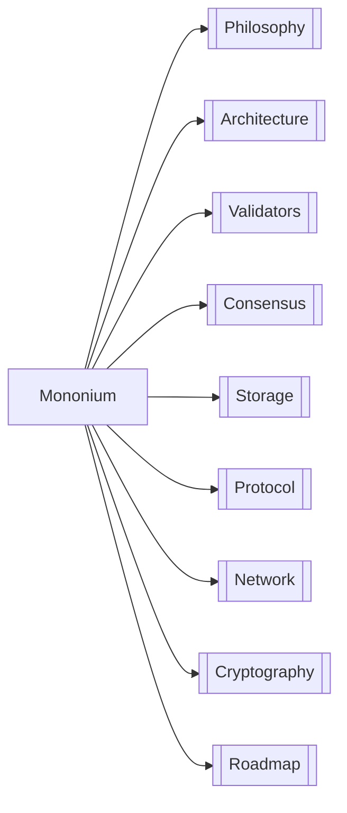

# Mononium — L1 Blockchain

**Mononium** is a Layer 1 blockchain built in Rust. Native token is **Monium (MONEX)**.

| Area            | Doc              | Key Decisions                                 |
| --------------- | ---------------- | --------------------------------------------- |
| 🧠 Philosophy   | [[Philosophy]]   | Account-based, minimalism, portfolio project  |
| 🏗️ Architecture | [[Architecture]] | Cargo workspace: lib + CLI + GUI              |
| 👥 Validators   | [[Validators]]   | Cheap VPS target, PoS, lightweight            |
| ⚡ Consensus    | [[Consensus]]    | PoS, 5s block, 20s finality                   |
| 💾 Storage      | [[Storage]]      | ITTIA DB Lite, mutable + append-only tables   |
| 📋 Protocol     | [[Protocol]]     | Account model, native tx first, state machine |
| 🌐 Network      | [[Network]]      | Localnet → Devnet → Testnet → Mainnet         |
| 🔐 Cryptography | [[Cryptography]] | Ed25519, BLAKE3, Falcon later                 |
| 🗺️ Roadmap      | [[Roadmap]]      | 5 phases, benchmark early                     |

---

> **Next:** Start with [[Philosophy]] to understand the design rationale.
