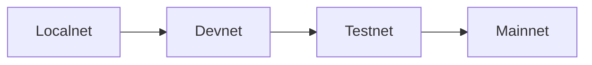

# Network

## Network Tiers

Mononium operates across 4 network tiers, each with separate genesis, chain ID, and peer discovery:



| Tier     | Chain ID | Purpose                 | Validators |
| -------- | -------- | ----------------------- | ---------- |
| Localnet | 0        | Single-node dev         | 1          |
| Devnet   | 1        | Multi-validator testing | 3+         |
| Testnet  | 2        | Public test network     | Community  |
| Mainnet  | 3        | Production              | Public     |

## Network Configuration

Each network differs in:

- **Genesis file** — initial accounts, stakes, parameters
- **Chain ID** — replay protection between networks
- **Bootstrap peers** — seed nodes for P2P discovery
- **Consensus parameters** — may vary (e.g., Testnet could have faster block times)

## P2P Layer

The networking layer handles:

- Peer discovery via bootstrap nodes
- Transaction gossip (mempool propagation)
- Block propagation
- Consensus messages (proposals, votes)

## Development Progression

```
Localnet (dev machine)
    → Devnet (3+ VPS)
        → Testnet (open to community)
            → Mainnet (production)
```

## Replay Protection

Every transaction includes the chain ID. A tx signed for Localnet (ID 0) cannot be replayed on Mainnet (ID 3). This is enforced at the state machine level.

---

**Related:** [Validators](Validators.md), [Protocol](Protocol.md), [Roadmap](Roadmap.md)
