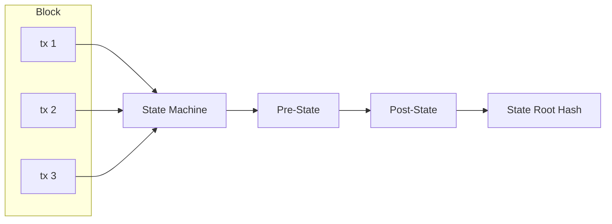

# Protocol

## State Model

Account-based (not UTXO). Addresses map directly to account objects.

```
Account {
    address: [u8; 32],
    balance: U256,
    nonce: u64,
    code_hash: Option<[u8; 32]>,  // for future smart contracts
}
```

## Transaction Types (V1)

1. **Transfer** — Move MONEX between accounts
2. **Stake** — Lock MONEX to become/activate a validator
3. **Unstake** — Begin withdrawal from validator set
4. **RegisterValidator** — Declare intent to validate

## Transaction Format (Sketch)

```
Transaction {
    chain_id: u64,           // replay protection
    nonce: u64,              // account nonce
    sender: [u8; 32],        // source address
    recipient: [u8; 32],     // destination address
    amount: U256,            // value transfer
    fee: U256,               // gas / fee
    tx_type: u8,             // transfer, stake, etc.
    payload: Option<Vec<u8>>, // additional data
    signature: [u8; 64],     // Ed25519 signature
}
```

## Block Structure (Sketch)

```
Block {
    header: BlockHeader,
    transactions: Vec<Transaction>,
    votes: Vec<CommitVote>,
}

BlockHeader {
    height: u64,
    parent_hash: [u8; 32],
    state_root: [u8; 32],
    tx_root: [u8; 32],
    timestamp: u64,
    proposer: [u8; 32],
    chain_id: u64,
}
```

## State Transition



- Transactions are applied in order within a block
- Each tx is validated (signature, nonce, balance) before execution
- State root after block = cryptographic commitment to full state
- Re-execute any block → deterministic state

## Chain ID

Each network gets a unique chain ID to prevent replay attacks across networks:

| Network  | Chain ID |
| -------- | -------- |
| Localnet | 0        |
| Devnet   | 1        |
| Testnet  | 2        |
| Mainnet  | 3        |

---

**Related:** [[Architecture]], [[Consensus]], [[Network]]
