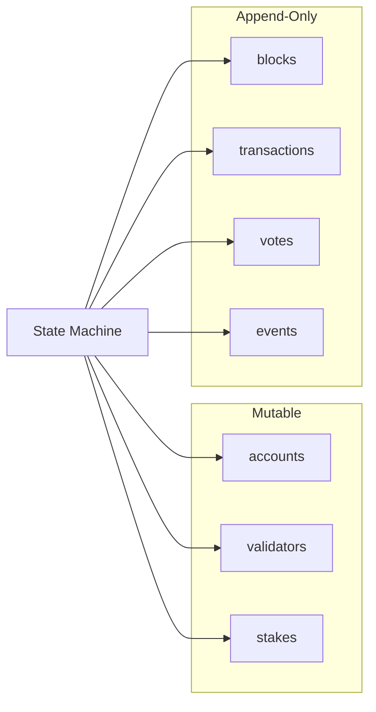

# Storage

## Database: ITTIA DB Lite

Mononium uses **ITTIA DB Lite** as its embedded database engine. ITTIA is a relational embedded database designed for embedded and real-time systems.

## Why ITTIA

| Requirement             | How ITTIA Meets It                               |
| ----------------------- | ------------------------------------------------ |
| Deterministic latency   | Predictable WCET for state access                |
| Low RAM                 | Fixed memory footprint                           |
| Low write amplification | Append-only tables for history                   |
| Relational              | Familiar SQL-based access patterns               |
| Embedded                | No separate server process, links into mononiumd |

## Table Layout

### Mutable Tables (Live State)

| Table        | Contents                             |
| ------------ | ------------------------------------ |
| `accounts`   | Address → balance, nonce, code hash  |
| `validators` | Validator public keys, stake, status |
| `stakes`     | Delegation/staking records           |

### Append-Only Tables (History/Ledger)

| Table          | Contents                |
| -------------- | ----------------------- |
| `blocks`       | Block headers, metadata |
| `transactions` | Raw transaction data    |
| `votes`        | Consensus votes         |
| `events`       | State transition logs   |

## Architecture

## Design Decisions

- **Mutable** tables hold current live state (accounts, validators, stakes)
- **Append-only** tables hold the immutable ledger (blocks, txs, votes)
- Append-only tables are compressed for long-term storage
- State and ledger tables are physically separated
- No historical mutation — history is append-only and immutable

## Compression

- Archive/history tables are compressed on disk
- Low write amplification means less compaction overhead
- Deterministic latency applies to both read and write paths

---

**Related:** [[Architecture]], [[Protocol]]
