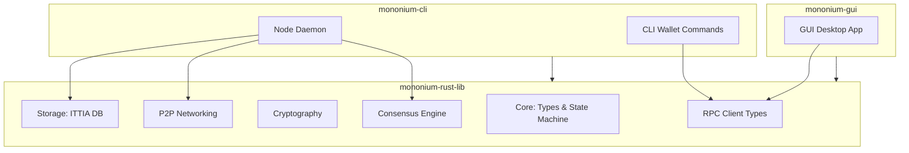

# Architecture

## Cargo Workspace

Mononium is a **Cargo workspace** with three crates:

```
mononium/
├── Cargo.toml              # workspace root
├── mononium-rust-lib/      # core library (all shared logic)
├── mononium-cli/           # CLI binary (node + wallet)
└── mononium-gui/           # GUI binary (desktop app)
```

## Crate Overview



## mononium-rust-lib

The shared library that both CLI and GUI depend on. Contains all blockchain logic:

| Module       | Responsibility                                         |
| ------------ | ------------------------------------------------------ |
| `core/`      | Account types, U256, state machine, tx processing      |
| `consensus/` | PoS consensus engine                                   |
| `crypto/`    | Ed25519 signing/verification, BLAKE3 hashing           |
| `storage/`   | ITTIA DB Lite interface (mutable + append-only tables) |
| `network/`   | P2P networking, peer discovery, message gossip         |
| `rpc/`       | RPC client types and serialization                     |

## mononium-cli

The CLI binary. Has two roles:

- **Node daemon** — runs the validator, participates in consensus, maintains state
- **CLI wallet** — key generation, tx signing, balance queries via RPC

```
mononium-cli
├── node          # start the node daemon
├── wallet        # wallet commands
│   ├── keygen    # generate keys
│   ├── balance   # query balance
│   ├── transfer  # send MONEX
│   └── stake     # stake/unstake
└── query         # chain queries (block, tx, validator set)
```

## mononium-gui

Desktop GUI application for wallets, block exploration, and network monitoring. Built on `mononium-rust-lib`. Connects to a running node via RPC — does not run a node itself.

## State Model

- **Account-based** (not UTXO)
- Balances stored as `U256`
- 18 decimal places
- Deterministic state transitions — same input → same output

## Key Decisions

| Decision          | Rationale                                                       |
| ----------------- | --------------------------------------------------------------- |
| Rust              | Safety, performance, ecosystem                                  |
| Account model     | Simpler than UTXO for V1                                        |
| Relational DB     | ITTIA DB Lite — deterministic, low RAM, low write amplification |
| 3-crate workspace | Clean separation: lib shared by CLI + GUI                       |
| CLI-first         | Node + wallet shipped first; GUI follows                        |

## Dependency Flow

```
mononium-rust-lib     ← no workspace deps (external crates only)
mononium-cli          → depends on mononium-rust-lib
mononium-gui          → depends on mononium-rust-lib
```

No circular dependencies. The lib has zero knowledge of CLI or GUI — it's pure blockchain logic.

---

**Related:** [[V0.1.0/Protocol]], [[V0.1.0/Storage]], [[V0.1.0/Validators]], [[V0.1.0/Roadmap]]
