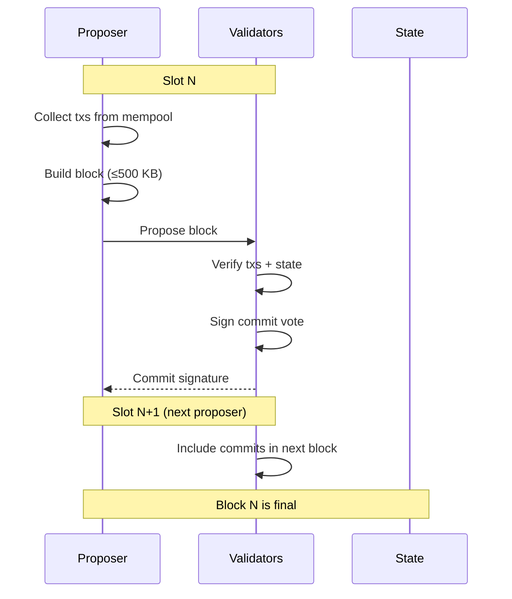

# Consensus

## Overview

Proof of Stake consensus with a fixed 5-second block time and 20-second finality.

## Parameters

| Parameter          | Value      | Notes                                 |
| ------------------ | ---------- | ------------------------------------- |
| Type               | PoS        |                                       |
| Block time         | 5s         | Fixed, not variable                   |
| Finality           | ~5-10s     | 1-2 blocks (BFT commit)               |
| Block size         | 500 KB     | Hard cap                              |
| Finality mechanism | BFT commit | Per-block, 2/3+ validator sigs        |
| Era length         | 720 blocks | ~1 hour — validator set recalculation |

## Eras

An era is the period between **validator set recalculations**. Every N blocks, the election runs again.

```
Era boundary (block % 720 == 0):
  1. Snapshot candidate pool
  2. Run ValidatorElection::elect()
  3. Commit new active set to state
  4. Reset proposer schedule
```

### Era 0 (Bootstrap)

Era 0 has no stake requirement — any registered key participates and earns MONEX. After era 0 ends, normal Top-N election takes over.

```rust
pub enum ElectionMode {
    /// Era 0 only: no minimum stake
    Open,
    /// Era 1+: standard Top-N by stake
    TopN { max_validators: usize },
}
```

### What changes at era boundaries

| Element              | Changes? | Notes                     |
| -------------------- | -------- | ------------------------- |
| Active validator set | ✅ Yes   | New election result       |
| Proposer schedule    | ✅ Yes   | Resets with new set       |
| Block production     | ❌ No    | Continuous                |
| Mempool              | ❌ No    | Continuous                |
| Finality             | ❌ No    | Continuous                |
| Staking balances     | ❌ No    | Changes apply immediately |

## Finality: BFT Commit Per Block

After a block is proposed, validators verify and submit a signed commit vote. Once 2/3+ of the active set commits, the block is final.

```
slot 0: V1 proposes Block A → validators vote
slot 1: V2 proposes Block B (includes commit proofs from slot 0) → A is final
```

- Commits are included in the _next_ block header as proof
- A block is final as soon as 2/3+ commits for it appear on-chain
- In practice: 1-2 blocks after proposal (~5-10s)

## Flow



## Commit Format (Sketch)

```
CommitVote {
    block_hash: [u8; 32],
    validator: ValidatorId,
    signature: [u8; 64],
}
```

## Forks

If a proposer equivocates (proposes two blocks at the same slot), validators:

1. Reject duplicates at the protocol level
2. Slash the validator (lose stake)
3. The next honest proposer resolves the fork

## Future: GRANDPA (V2.0+)

GRANDPA can be added as an alternative finality gadget via the same DI pattern. It finalizes many blocks at once, which is useful for larger validator sets or when network latency varies.

## Throughput

TPS is not a fixed target — it emerges from:

```
TPS ≈ block size / avg tx size / block time
```

With 500 KB blocks, 5s block time, and typical tx sizes:

| Tx Size | TPS (approx) |
| ------- | ------------ |
| 100 B   | ~1,000       |
| 250 B   | ~400         |
| 500 B   | ~200         |
| 1 KB    | ~100         |

## Mempool

Transaction pool ordering:

| Priority | Field         | Order          | Why                |
| -------- | ------------- | -------------- | ------------------ |
| 1        | Tip           | Highest first  | Economic incentive |
| 2        | Time received | Earliest first | Fairness           |
| 3        | Nonce         | Lowest first   | Prevent nonce gaps |

```rust
pub struct MempoolConfig {
    pub max_size: usize,     // 10,000
    pub ttl: Duration,       // 10 minutes
    pub min_fee: U256,       // minimum fee to enter pool
}
```

The proposer selects the highest-priority txs for their block up to the 500 KB limit.

## Validator Election

Validators are elected via **Top-N by stake** (see [Validators](Validators.md#Validator Election)). The election algorithm is swappable via dependency injection for future Phragmén support.

## Block Production

### V1: Round-Robin

Active validators take turns proposing blocks in a fixed order. The proposer schedule is deterministic:

```
slot 0: validator_1
slot 1: validator_2
slot 2: validator_3
slot 3: validator_4
slot 4: validator_1  (cycles)
...
```

- Order is determined at era boundaries (when active set is elected)
- All validators can compute the proposer for any slot independently
- Simple, predictable, easy to debug with Docker

### Future: VRF Leader Election (V2.0+)

Randomized proposer selection via Verifiable Random Function. Each validator runs VRF each slot; lowest output wins.

### DI Pattern

Same trait-based approach as [Validators](Validators.md#Validator Election):

```rust
#[async_trait]
pub trait ProposerSelection: Send + Sync {
    fn select_proposer(&self, slot: u64, active_set: &[ValidatorId]) -> ValidatorId;
}

pub struct RoundRobin;
impl ProposerSelection for RoundRobin {
    fn select_proposer(&self, slot: u64, active_set: &[ValidatorId]) -> ValidatorId {
        active_set[slot as usize % active_set.len()]
    }
}
```

```rust
ConsensusConfig {
    election: Box::new(TopNElection),
    proposer: Box::new(RoundRobin),
    block_time: Duration::from_secs(5),
    epoch_length: 720,
}
```

## Consensus Overhead Includes

- Message propagation
- Signature aggregation
- State validation per block

## Attack Resistance

- **Nothing at stake**: To be addressed (slashing, checkpointing)
- **Long-range attack**: To be addressed (key-evolving signatures or checkpointing)
- **Censorship**: Multiple proposers via round-robin or VRF selection

---

**Related:** [Validators](Validators.md), [Protocol](Protocol.md)
