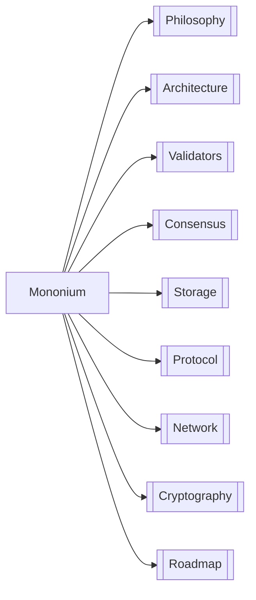

# Mononium — L1 Blockchain

**Mononium** is a Layer 1 blockchain built in Rust. Native token is **Monium (MONEX)**.

| Area            | Doc                     | Key Decisions                                 |
| --------------- | ----------------------- | --------------------------------------------- |
| 🧠 Philosophy   | [Philosophy](plans/V0.1.0/Philosophy.md)   | Account-based, minimalism, portfolio project  |
| 🏗️ Architecture | [Architecture](plans/V0.1.0/Architecture.md) | Cargo workspace: lib + CLI + GUI              |
| 👥 Validators   | [Validators](plans/V0.1.0/Validators.md)   | Cheap VPS target, PoS, lightweight            |
| ⚡ Consensus    | [Consensus](plans/V0.1.0/Consensus.md)    | PoS, 5s block, 20s finality                   |
| 💾 Storage      | [Storage](plans/V0.1.0/Storage.md)      | ITTIA DB Lite, mutable + append-only tables   |
| 📋 Protocol     | [Protocol](plans/V0.1.0/Protocol.md)     | Account model, native tx first, state machine |
| 🌐 Network      | [Network](plans/V0.1.0/Network.md)      | Localnet → Devnet → Testnet → Mainnet         |
| 🔐 Cryptography | [Cryptography](plans/V0.1.0/Cryptography.md) | Ed25519, BLAKE3, Falcon later                 |
| 🗺️ Roadmap      | [Roadmap](plans/V0.1.0/Roadmap.md)      | 5 phases, benchmark early                     |

---

> **Next:** Start with [Philosophy](plans/V0.1.0/Philosophy.md) to understand the design rationale.
