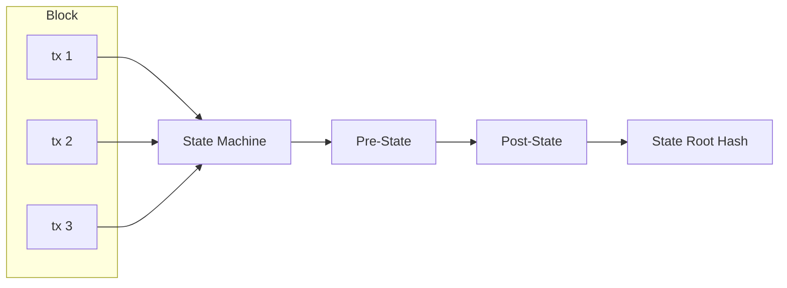

# Protocol

## Serialization

| Layer                                 | Format                     | Why                              |
| ------------------------------------- | -------------------------- | -------------------------------- |
| **Wire protocol** (blocks, tx, votes) | SCALE (parity-scale-codec) | Compact, fast, derive-based      |
| **State storage** (ITTIA rows)        | SCALE                      | Same as wire — consistent        |
| **RPC** (API responses)               | JSON (serde)               | Human-readable, standard clients |

```rust
// One struct, both formats via dual derives
#[derive(Encode, Decode, Serialize, Deserialize)]
pub struct Transaction {
    pub sender: [u8; 32],
    pub nonce: u64,
    // ... fields derive both SCALE + JSON serialization
}
```

## State Model

Account-based (not UTXO). Addresses map directly to account objects.

```
Account {
    address: [u8; 32],
    balance: U256,
    nonce: u64,
    code_hash: Option<[u8; 32]>,  // for future smart contracts
}
```

## Transaction Types (V1)

1. **Transfer** — Move MONEX between accounts
2. **Stake** — Lock MONEX to become/activate a validator
3. **Unstake** — Begin withdrawal from validator set
4. **RegisterValidator** — Declare intent to validate

## Transaction Format (Sketch)

```
Transaction {
    chain_id: u64,           // replay protection
    nonce: u64,              // account nonce
    sender: [u8; 32],        // source address
    recipient: [u8; 32],     // destination address
    amount: U256,            // value transfer
    fee: U256,               // gas / fee
    tx_type: u8,             // transfer, stake, etc.
    payload: Option<Vec<u8>>, // additional data
    signature: [u8; 64],     // Ed25519 signature
}
```

## Block Structure (Sketch)

```
Block {
    header: BlockHeader,
    transactions: Vec<Transaction>,
    votes: Vec<CommitVote>,
}

BlockHeader {
    height: u64,
    parent_hash: [u8; 32],
    state_root: [u8; 32],
    tx_root: [u8; 32],
    timestamp: u64,
    proposer: [u8; 32],
    chain_id: u64,
}
```

## State Transition



- Transactions are applied in order within a block
- Each tx is validated (signature, nonce, balance) before execution
- State root after block = cryptographic commitment to full state
- Re-execute any block → deterministic state

## Transaction Fees

Fee per transaction = **base component** + **size component** + **optional tip**

```rust
pub struct HybridFee {
    pub flat_fee: U256,         // minimum: 0.001 MONEX
    pub per_byte_rate: U256,    // per byte of tx size
    // tip is set by sender as part of Transaction
}

impl FeePolicy for HybridFee {
    fn calculate_fee(&self, tx: &Transaction) -> U256 {
        self.flat_fee + self.per_byte_rate * U256::from(tx.encoded_size()) + tx.tip
    }
}
```

| Component | Purpose                               | Set by             |
| --------- | ------------------------------------- | ------------------ |
| Flat fee  | Minimum cost per tx (spam prevention) | Protocol parameter |
| Per-byte  | Proportional to state/storage cost    | Protocol parameter |
| Tip       | Priority for block inclusion          | Sender             |

Swappable via `FeePolicy` trait.

## Genesis Distribution

| Network  | Total Supply | Recipients       | Notes                                   |
| -------- | ------------ | ---------------- | --------------------------------------- |
| Localnet | 10 MONEX     | 1 test key       | Single-node dev                         |
| Devnet   | 10 MONEX     | 3-5 test keys    | Multi-validator testing                 |
| Testnet  | 100 MONEX    | Community faucet | Public test network                     |
| Mainnet  | 0            | —                | Fair launch, bootstrapped via inflation |

On mainnet, MONEX is minted into existence through block rewards (see [Protocol](Protocol.md#Token Supply)). No pre-mine, no allocation, no insider advantage.

## Token Supply

### V1 Dev (Localnet/Devnet/Testnet): Fixed Supply

All MONEX are minted at genesis. No inflation, no block rewards. Validators earn only transaction fees.

### V2 Mainnet: Mixed Supply (Inflation with Cap)

Mainnet starts at 0 total supply. MONEX is minted via block rewards with a capped maximum supply. This replaces `FixedSupply` via the `SupplyPolicy` trait.

```rust
pub trait SupplyPolicy: Send + Sync {
    fn block_reward(&self, height: u64) -> U256;
}

pub struct FixedSupply;
impl SupplyPolicy for FixedSupply {
    fn block_reward(&self, _height: u64) -> U256 {
        U256::zero() // no inflation
    }
}
```

### Future: Mixed Supply (V2.0+)

Inflation is introduced, capped at a maximum total supply. Part minted as block rewards, part as a treasury/development fund.

```rust
pub struct CappedInflation {
    max_supply: U256,
    annual_rate: f64,  // e.g. 0.02 = 2%
}
impl SupplyPolicy for CappedInflation {
    fn block_reward(&self, height: u64) -> U256 { ... }
}
```

Swappable via `ConsensusConfig { supply: Box<dyn SupplyPolicy> }`.

## Chain ID

Each network gets a unique chain ID to prevent replay attacks across networks:

| Network  | Chain ID |
| -------- | -------- |
| Localnet | 0        |
| Devnet   | 1        |
| Testnet  | 2        |
| Mainnet  | 3        |

---

**Related:** [Architecture](plans/V0.1.0/Architecture.md), [Consensus](plans/V0.1.0/Consensus.md), [Network](plans/V0.1.0/Network.md)
