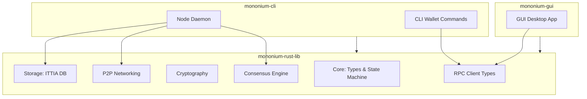

# Architecture

## Cargo Workspace

Mononium is a **Cargo workspace** with three crates:

```
mononium/
├── Cargo.toml              # workspace root
├── mononium-rust-lib/      # core library (all shared logic)
├── mononium-cli/           # CLI binary (node + wallet)
└── mononium-gui/           # GUI binary (desktop app)
```

## Crate Overview



## mononium-rust-lib

The shared library that both CLI and GUI depend on. Contains all blockchain logic:

| Module       | Responsibility                                                    |
| ------------ | ----------------------------------------------------------------- |
| `core/`      | Account types, U256, state machine, tx processing                 |
| `consensus/` | PoS consensus engine                                              |
| `mempool/`   | Transaction pool (tip → time → nonce ordering)                    |
| `crypto/`    | Ed25519 signing/verification, BLAKE3 hashing                      |
| `storage/`   | redb database (mutable + append-only tables, StorageEngine trait) |
| `network/`   | P2P networking, peer discovery, message gossip                    |
| `rpc/`       | RPC server (jsonrpsee + REST) and client types                    |

## mononium-cli

The CLI binary. Has two roles:

- **Node daemon** — runs the validator, participates in consensus, maintains state
- **CLI wallet** — key generation, tx signing, balance queries via RPC

```
mononium-cli
├── node          # start the node daemon
├── wallet        # wallet commands
│   ├── keygen    # generate keys
│   ├── balance   # query balance
│   ├── transfer  # send MONEX
│   └── stake     # stake/unstake
└── query         # chain queries (block, tx, validator set)
```

## mononium-gui

Desktop GUI application for wallets, block exploration, and network monitoring. Built on `mononium-rust-lib`. Connects to a running node via RPC — does not run a node itself.

## RPC Interface

Hybrid: **jsonrpsee** for mutations + subscriptions, **REST** for simple reads.

### JSON-RPC (jsonrpsee — WebSocket)

```rust
#[rpc(server)]
pub trait MononiumRpc {
    #[method(name = "send_tx")]
    async fn send_transaction(&self, tx: Transaction) -> RpcResult<Hash>;

    #[subscription(name = "subscribe_blocks", item = Block)]
    async fn subscribe_blocks(&self) -> SubscriptionResult;
}
```

### REST (axum — HTTP GET)

| Method | Path                 | Returns              |
| ------ | -------------------- | -------------------- |
| GET    | `/balance/{address}` | Account balance      |
| GET    | `/block/{height}`    | Block by height      |
| GET    | `/block/latest`      | Latest block         |
| GET    | `/tx/{hash}`         | Transaction by hash  |
| GET    | `/validators`        | Active validator set |

### CLI Usage

```bash
# REST reads
mononium-cli wallet balance 0x...          # GET /balance/0x...
mononium-cli query block 42               # GET /block/42

# JSON-RPC writes + subscriptions
mononium-cli wallet transfer 0x... 100    # jsonrpsee send_tx
mononium-cli node                          # starts RPC server
```

## State Model

- **Account-based** (not UTXO)
- Balances stored as `U256`
- 18 decimal places
- Deterministic state transitions — same input → same output

## Key Decisions

| Decision          | Rationale                                 |
| ----------------- | ----------------------------------------- |
| Rust              | Safety, performance, ecosystem            |
| Account model     | Simpler than UTXO for V1                  |
| Embedded DB       | redb — pure Rust, ACID, memory-mapped     |
| 3-crate workspace | Clean separation: lib shared by CLI + GUI |
| CLI-first         | Node + wallet shipped first; GUI follows  |

## Design Patterns

### Validator Election DI

The validator election algorithm is swappable via a trait + injection pattern in `mononium-rust-lib`:

```rust
// mononium-rust-lib/src/consensus/election.rs

/// Pluggable validator election strategy
#[async_trait]
pub trait ValidatorElection: Send + Sync {
    /// Select the active validator set from all candidates
    async fn elect(&self, candidates: &[ValidatorCandidate], max: usize) -> Vec<ValidatorId>;
}

// V1: Simple top-N by stake
pub struct TopNElection;

#[async_trait]
impl ValidatorElection for TopNElection {
    async fn elect(&self, candidates: &[ValidatorCandidate], max: usize) -> Vec<ValidatorId> {
        let mut sorted = candidates.to_vec();
        sorted.sort_by(|a, b| b.total_stake.cmp(&a.total_stake));
        sorted.into_iter().take(max).map(|c| c.id).collect()
    }
}

// Future: Phragmén election (separate module)
pub struct PhragmenElection;
```

The consensus engine takes `Box<dyn ValidatorElection>` at construction time, making the algorithm trivially swappable.

```rust
// mononium-rust-lib/src/consensus/mod.rs
pub struct ConsensusConfig {
    pub election: Box<dyn ValidatorElection>,
    pub block_time: Duration,
    pub epoch_length: u64,
}
```

The CLI config injects the concrete implementation:

```rust
// mononium-cli uses TopNElection
ConsensusConfig {
    election: Box::new(TopNElection),
    ...
}
```

## Dependency Flow

```
mononium-rust-lib     ← no workspace deps (external crates only)
mononium-cli          → depends on mononium-rust-lib
mononium-gui          → depends on mononium-rust-lib
```

No circular dependencies. The lib has zero knowledge of CLI or GUI — it's pure blockchain logic.

---

**Related:** [Protocol](plans/V0.2.0/Protocol.md), [Storage](plans/V0.2.0/Storage.md), [Validators](plans/V0.2.0/Validators.md), [Roadmap](plans/V0.2.0/Roadmap.md)
