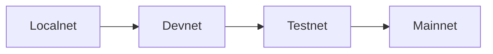

# Network

## Network Tiers

Mononium operates across 4 network tiers, each with separate genesis, chain ID, and peer discovery:



| Tier     | Chain ID | Purpose                 | Validators |
| -------- | -------- | ----------------------- | ---------- |
| Localnet | 0        | Single-node dev         | 1          |
| Devnet   | 1        | Multi-validator testing | 3+         |
| Testnet  | 2        | Public test network     | Community  |
| Mainnet  | 3        | Production              | Public     |

## Network Configuration

Each network differs in:

- **Genesis file** — initial accounts, stakes, parameters
- **Chain ID** — replay protection between networks
- **Bootstrap peers** — seed nodes for P2P discovery
- **Consensus parameters** — may vary (e.g., Testnet could have faster block times)

## P2P Layer

Mononium uses **libp2p** (rust-libp2p) with:

- **Gossipsub** for block, transaction, vote, and evidence propagation
- **Kademlia** for peer discovery after bootstrap
- **Identify** protocol for peer metadata
- **mDNS** for localnet auto-discovery

### Topics

Four gossipsub topics, each scoped by chain_id:

| Topic                          | Message Type               | Purpose                |
| ------------------------------ | -------------------------- | ---------------------- |
| `mononium/txs/{chain_id}`      | `Vec<Transaction>` (SCALE) | Mempool propagation    |
| `mononium/blocks/{chain_id}`   | `Block` (SCALE)            | New block announcement |
| `mononium/votes/{chain_id}`    | `CommitVote` (SCALE)       | Consensus votes        |
| `mononium/evidence/{chain_id}` | `Evidence` (SCALE)         | Slashing evidence      |

### Ports

| Service              | Default Port | Flag          | Notes                                 |
| -------------------- | ------------ | ------------- | ------------------------------------- |
| P2P (libp2p)         | **30333**    | `--p2p-port`  | Peer-to-peer networking               |
| JSON-RPC (WebSocket) | **9944**     | `--rpc-port`  | Transaction submission, subscriptions |
| REST (HTTP)          | **9933**     | `--rest-port` | Balance queries, block lookups        |

Following Polkadot convention — well-known to blockchain operators.

### Peer Discovery

```bash
# Start node with bootstrap peers
mononium-cli node \
  --genesis configs/genesis.devnet.json \
  --key my-validator \
  --bootnodes /ip4/1.2.3.4/tcp/30333/p2p/Qm...
```

1. Node connects to specified bootstrap peers via their multiaddrs
2. Kademlia discovers additional peers sharing the same chain_id
3. mDNS handles localnet auto-discovery (no bootnodes needed)
4. Identify protocol exchanges version and peer metadata

### Transport Compression

libp2p's built-in **snappy** compression is enabled at the transport layer. This compresses wire bytes transparently without affecting consensus hashing (blocks are always hashed uncompressed).

## Sync Protocol

Nodes synchronize the chain via a dedicated libp2p **Request-Response** protocol (separate from gossipsub). A node entering the network enters **sync mode** first — it does not participate in consensus until caught up to the chain tip.

### Messages

**Pair 1: Height-based sync (catch-up from genesis, checkpoint, or gap)**

```rust
struct BlockSyncRequest {
    pub start_height: u64,        // first block to request
    pub max_blocks: u16,          // up to 500 (hard cap)
    pub direction: SyncDirection,
    pub known_block_hash: Option<[u8; 32]>,  // if included, peer verifies canonical fork
}

enum SyncDirection {
    Forward,   // normal catch-up
    Backward,  // recent blocks from tip (for quick new-peer bootstrap)
}

struct BlockSyncResponse {
    pub blocks: Vec<Block>,
    pub highest_height: u64,       // peer's current tip
}
```

**Pair 2: Hash-based sync (specific block provenance)**

```rust
struct BlockByHashRequest {
    pub block_hashes: Vec<[u8; 32]>,  // up to 100
}

struct BlockByHashResponse {
    pub blocks: Vec<Block>,            // in request order, missing entries omitted
}
```

**Pair 3: Checkpoint sync (fast bootstrap)**

```rust
struct CheckpointRequest {
    pub target_height: u64,       // nearest checkpoint boundary
}

struct CheckpointResponse {
    pub height: u64,
    pub smt_nodes: Vec<(Vec<u8>, Vec<u8>)>,  // serialized SMT key-value pairs
    pub validator_set_hash: [u8; 32],
    pub checkpoint_hash: [u8; 32],  // BLAKE3 — verified out-of-band
}
```

### Sync Flow

```
1. Connect to bootstrap peers
2. Send BlockSyncRequest { direction: Backward, max_blocks: 1 }
   → learn peer's highest_height
3. If tip height - genesis < threshold → replay from genesis (fast on devnet)
4. If tip height - genesis > threshold → request checkpoint at nearest boundary
5. Apply checkpoint → fast-forward to checkpoint state
6. Request remaining blocks forward: start_height = checkpoint_height + 1
7. Each received block is verified (sig, parent_hash, tx_root, re-execute → state_root)
8. On verification failure → disconnect peer, try another
```

### Retry Logic

| Attempt | Timeout                     |
| ------- | --------------------------- |
| 1st     | 5s                          |
| 2nd     | 10s                         |
| 3rd     | 15s                         |
| 4th     | Give up, try different peer |

After 3 failures on different peers, the node logs a critical error and stays in sync mode.

## Development Progression

```
Localnet (dev machine)
    → Devnet (3+ VPS)
        → Testnet (open to community)
            → Mainnet (production)
```

## Replay Protection

Every transaction includes the chain ID. A tx signed for Localnet (ID 0) cannot be replayed on Mainnet (ID 3). This is enforced at the state machine level.

---

**Related:** [Validators](plans/V0.2.0/Validators.md), [Protocol](plans/V0.2.0/Protocol.md), [Roadmap](plans/V0.2.0/Roadmap.md)
