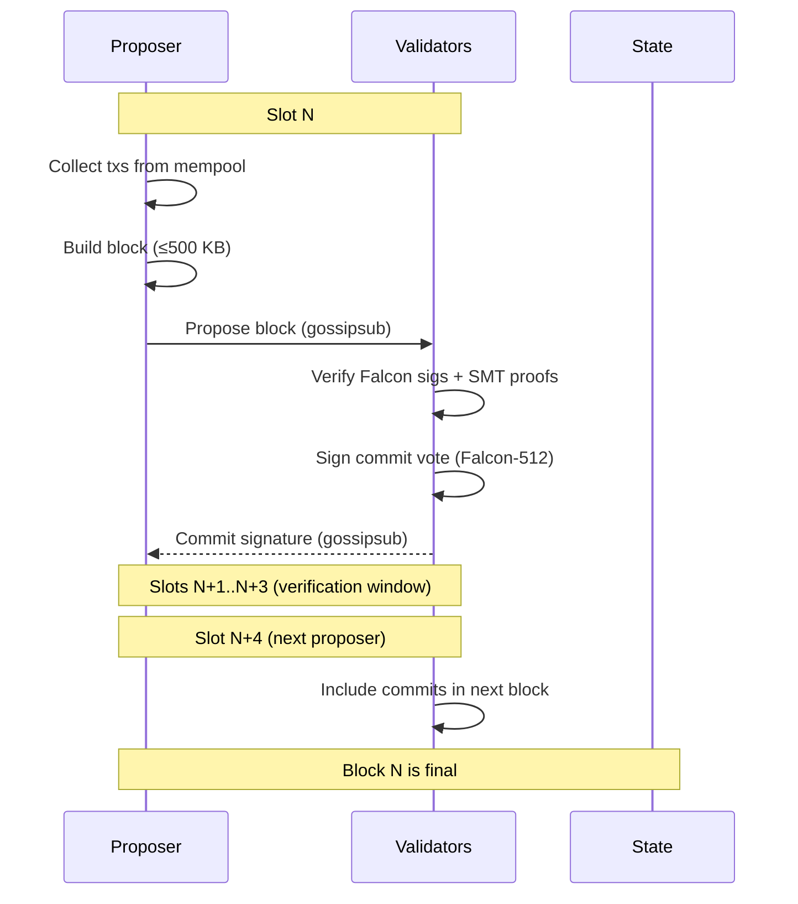

# Consensus

## Overview

Proof of Stake consensus with a fixed 5-second block time and 20-second finality.

## Parameters

| Parameter          | Value      | Notes                                 |
| ------------------ | ---------- | ------------------------------------- |
| Type               | PoS        |                                       |
| Block time         | 5s         | Fixed, not variable                   |
| Finality           | ~20s       | 4 blocks (BFT commit)                 |
| Block size         | 500 KB     | Hard cap                              |
| Finality mechanism | BFT commit | Per-block, 2/3+ validator sigs        |
| Era length         | 720 blocks | ~1 hour — validator set recalculation |

## Eras

An era is the period between **validator set recalculations**. Every N blocks, the election runs again.

```
Era boundary (block % 720 == 0):
  1. The proposer for block 720 snapshots the candidate pool
  2. Runs ValidatorElection::elect()
  3. Commits the new active set to state as part of block 720
  4. Resets proposer schedule — validators update their local schedule after verifying block 720
  5. Block 721 is the first block produced under the new set
```

### Era 0 (Bootstrap)

The genesis state has **no validators** — the active set starts empty. A **bootstrap key** designated in the genesis config is the sole proposer for the first N blocks.

#### Bootstrap Phase

The genesis JSON defines a `bootstrap` field:

```json
{
  "bootstrap": {
    "public_key": "0x...",
    "blocks": 20
  }
}
```

- Block 1 launches the bootstrap phase. Only the bootstrap key's blocks are accepted.
- The bootstrap proposer includes txs from other validators (RegisterValidator, Stake) as they arrive.
- On mainnet, the bootstrap proposer earns block rewards (CappedInflation) which fund their own registration fees.
- On dev tiers, genesis `accounts` supply the MONEX for registration fees.

#### Bootstrap Duration per Tier

| Tier     | Bootstrap blocks | Wall clock | Why                                             |
| -------- | :--------------: | :--------: | ----------------------------------------------- |
| Localnet |      **1**       |     5s     | Single key, proposal starts immediately         |
| Devnet   |      **20**      |    100s    | 3-5 validators register in under 2 minutes      |
| Testnet  |     **100**      |   ~8 min   | Community validators need a wider window        |
| Mainnet  |     **100**      |   ~8 min   | Same — bootstrap key + inflation handles launch |

#### End of Bootstrap Phase

When the bootstrap phase ends (block N+1), the bootstrap key runs the election:

1. Snapshot all registered validators from the bootstrap blocks
2. Commit them as era 0's active set (up to `max_validators`)
3. Normal round-robin proposer schedule begins
4. Bootstrap key has no special status — they participate as a regular validator if they registered

#### Era 0 Active Set

Once the election runs, all registered validators are automatically active (up to `max_validators`). No stake required — validators earn fees (and on mainnet, block rewards) to accumulate starting stake for era 1+.

#### Era 1+

Normal Top-N election takes over with a minimum 1 MONEX stake requirement.

```rust
pub enum ElectionMode {
    /// Era 0 only: no minimum stake
    Open,
    /// Era 1+: standard Top-N by stake
    TopN { max_validators: usize },
}
```

### What changes at era boundaries

| Element              | Changes? | Notes                     |
| -------------------- | -------- | ------------------------- |
| Active validator set | ✅ Yes   | New election result       |
| Proposer schedule    | ✅ Yes   | Resets with new set       |
| Block production     | ❌ No    | Continuous                |
| Mempool              | ❌ No    | Continuous                |
| Finality             | ❌ No    | Continuous                |
| Staking balances     | ❌ No    | Changes apply immediately |

## Finality: BFT Commit Per Block

After a block is proposed, validators verify and submit a signed commit vote. Once 2/3+ of the active set commits, the block is final.

```
slot 0: V1 proposes Block A → validators verify + vote
slot 1-3: verification window (validators verify Falcon-512 sigs, state, SMT)
slot 4: V2 proposes Block B (includes commit proofs from slot 0) → A is final
```

- Commits are included in the _next_ block header as proof
- A block is final as soon as 2/3+ commits for it appear on-chain
- In practice: **~20s (4 blocks)** — proposer submits, validators have 3 blocks to verify and submit commit votes
- The 20s verification window accounts for Falcon-512 signature verification (~10x slower than Ed25519) and SMT validation

## Flow



## Commit Format (Sketch)

```
CommitVote {
    block_hash: [u8; 32],
    validator: ValidatorId,
    signature: [u8; 666],       // Falcon-512
}
```

## Forks

If a proposer equivocates (proposes two blocks at the same slot), validators:

1. Reject duplicates at the protocol level
2. **Slash** 90% of the validator's stake (10% remains staked with the validator)
3. The **reporter** (validator who submitted the evidence) receives a **10% bounty** of the slashed amount, added to their validator stake
4. The next honest proposer resolves the fork

### Slashing Details

| Dimension              | Value                                                                        |
| ---------------------- | ---------------------------------------------------------------------------- |
| **Equivocation**       | 90% of stake is slashed; 10% remains staked with the validator               |
| **Burn**               | 90% of slashed amount → Burn address (`0x00..00`)                            |
| **Reporter bounty**    | 10% of slashed amount → added to reporter's **validator stake**              |
| **Validator retains**  | 10% of original stake **stays staked** — not ejected from candidate pool     |
| **Burn effect**        | Coins at Burn address are permanently destroyed. No effect on inflation cap. |
| **Liveness**           | Not slashed in V1 (replaced at era boundary if inactive)                     |
| **Evidence topic**     | Gossiped on `mononium/evidence/{chain_id}`                                   |
| **Unstaking cooldown** | 7 days (constant, prevents gaming after violations)                          |

Example: validator with 1000 MONEX staked equivocates:

```
1000 stake
  ↓
  900 slashed (90%)   → 810 Burn, 90 to reporter's stake
  100 remains          → still staked with validator
```

**Bounty is staked, not liquid:** The 10% reporter bounty is added to the reporter's validator stake, not their transferable balance. This prevents two attack vectors:

1. **Slash-and-dump** — a validator who spots equivocation cannot immediately withdraw and cash out the reward
2. **Collusion exit** — the attacker and reporter cannot collude to bypass the unstaking cooldown (attacker intentionally equivocates, reporter gets liquid bounty, they split it out-of-band). With the bounty staked, both sides are bound by the 7-day unstaking lock.

**Validator's remaining 10% stays staked** — the validator is not ejected from the candidate pool. They keep a reduced stake and can continue validating (if still in Top-N) or choose to unstake with the standard 7-day cooldown.

**Two special addresses:**

| Address    | Role           | Effect                                                                                                                                             |
| ---------- | -------------- | -------------------------------------------------------------------------------------------------------------------------------------------------- |
| `0x00..00` | **Burn**       | Slashed stake (90%) sent here. Permanently destroyed. No cap effect.                                                                               |
| `0x00..01` | **Cap-Refill** | Voluntarily send MONEX here to expand the mainnet inflation cap. Coins are a sink (irreversible). Effective max supply = 10B + cap_refill_balance. |

The Burn address and Cap-Refill address are known protocol constants. Anyone can send to either, but only slashing logic uses Burn automatically.

Slashing evidence is an `EquivocationEvidence` message containing the **block headers + Falcon signatures** (not the full blocks). This keeps evidence small (~1.5 KB per event vs ~1 MB for full blocks).

```rust
/// Proof that a validator signed two different blocks at the same height
struct EquivocationEvidence {
    pub header_a: BlockHeader,
    pub signature_a: [u8; 666],
    pub header_b: BlockHeader,
    pub signature_b: [u8; 666],
    pub proposer_id: ValidatorId,
}
```

**Verification:**

1. `header_a.height == header_b.height`
2. `header_a.parent_hash == header_b.parent_hash` (same slot — resolves to same parent)
3. `header_a != header_b` (distinct blocks — proves equivocation, not re-gossip)
4. `falcon_verify(proposer_pk, header_a, signature_a)` — both genuinely signed
5. `falcon_verify(proposer_pk, header_b, signature_b)` — both genuinely signed

If all checks pass, the proposer is slashed 90% and the reporter receives a 10% bounty.

## Future: GRANDPA (V2.0+)

GRANDPA can be added as an alternative finality gadget via the same DI pattern. It finalizes many blocks at once, which is useful for larger validator sets or when network latency varies.

## Throughput

TPS is not a fixed target — it emerges from:

```
TPS ≈ block size / avg tx size / block time
```

With Falcon-512 signatures (666 bytes per tx), realistic tx sizes are larger than the original Ed25519 estimates:

| Tx Size | TPS (approx) |
| ------- | ------------ |
| 500 B   | ~200         |
| 800 B   | ~125         |
| 1 KB    | ~100         |
| 1.5 KB  | ~66          |

Realistic V1 throughput: **100-200 TPS** with Falcon-512 signatures, which aligns with the "Cheap Validators First" philosophy.

## Mempool

Transaction pool ordering:

| Priority | Field         | Order          | Why                |
| -------- | ------------- | -------------- | ------------------ |
| 1        | Tip           | Highest first  | Economic incentive |
| 2        | Time received | Earliest first | Fairness           |
| 3        | Nonce         | Lowest first   | Prevent nonce gaps |

### Nonce Buffering

Out-of-order nonces are **buffered** — the mempool does not relay or select a tx until all lower nonces from the same sender have been received. This prevents nonce gaps from blocking block production.

- **Buffer expiry:** 10 minutes (matches mempool TTL)
- **Per-sender cap:** 30 buffered nonces — if exceeded, oldest buffered tx is dropped for that sender
- **Sender spam mitigation:** the cap prevents an adversary from filling the mempool with nonces from a single key

Once the missing lower nonce arrives, all buffered txs from that sender are released into the relay/selection pool in nonce order.

### Configuration

```rust
pub struct MempoolConfig {
    pub max_size: usize,         // 10,000
    pub ttl: Duration,           // 10 minutes
    pub min_fee: U256,           // local filter — not a consensus parameter
    pub max_pending_per_sender: u32,  // 30 — per-sender nonce buffer cap
}
```

The `min_fee` is a local node policy. Each operator sets their own threshold (default: `0.0667 MONEX`). A tx below this fee is rejected from the local mempool but is still valid if included by another validator. This lets operators tune their own spam tolerance without affecting consensus.

The proposer selects the highest-priority txs for their block up to the 500 KB limit.

## Validator Election

Validators are elected via **Top-N by stake** (see [Validators](Validators.md#Validator Election)). The election algorithm is swappable via dependency injection for future Phragmén support.

## Block Production

### V1: Round-Robin

Active validators take turns proposing blocks in a fixed order. The proposer schedule is deterministic:

```
slot 0: validator_1
slot 1: validator_2
slot 2: validator_3
slot 3: validator_4
slot 4: validator_1  (cycles)
...
```

- Order is determined at era boundaries (when active set is elected)
- All validators can compute the proposer for any slot independently
- Simple, predictable, easy to debug with Docker

### Future: VRF Leader Election (V2.0+)

Randomized proposer selection via Verifiable Random Function. Each validator runs VRF each slot; lowest output wins.

### Slot Model

Blocks and slots are **not equivalent**. Slots are time intervals (5s each); blocks are proposals that may or may not fill every slot.

**Option B (adopted): Height = blocks proposed, not slots**

```
slot  0: V1 proposes Block 10  ✓    → height 10
slot  1: V2 is offline               → empty slot, no height change
slot  2: V3 proposes Block 11  ✓    → height 11 (builds on Block 10)
slot  3: V4 proposes Block 12  ✓    → height 12
```

- Height increments only when a block is actually proposed
- Block N always builds on Block N-1
- Empty slots are transparent to the state machine

**Rejected — Option A (height = slot index):** Would create phantom state gaps

```
slot  0: Block 0
slot  1: (empty) → height 1 exists with no block → complicates sync + state queries
```

### Missed Slots

If the proposer for a slot is offline, the **slot goes empty**:

- After 5s (block time elapses) with no block from the expected proposer, validators do nothing
- No votes are cast (nothing to vote on)
- The next proposer in the round-robin schedule builds on the last canonical block
- Height increments only when a block is actually proposed

**0.08 MONEX flat penalty** per missed slot. Applied at era boundary during validator set reconciliation (not per-slot slashing — avoids mid-era consensus disputes).

An inactive validator who accumulates penalties will naturally fall out of the Top-N by stake at the next era boundary.

### DI Pattern

Same trait-based approach as [Validators](Validators.md#Validator Election):

```rust
#[async_trait]
pub trait ProposerSelection: Send + Sync {
    fn select_proposer(&self, slot: u64, active_set: &[ValidatorId]) -> ValidatorId;
}

pub struct RoundRobin;
impl ProposerSelection for RoundRobin {
    fn select_proposer(&self, slot: u64, active_set: &[ValidatorId]) -> ValidatorId {
        active_set[slot as usize % active_set.len()]
    }
}
```

```rust
ConsensusConfig {
    election: Box::new(TopNElection),
    proposer: Box::new(RoundRobin),
    block_time: Duration::from_secs(5),
    epoch_length: 720,
}
```

## Consensus Overhead Includes

- Message propagation
- Falcon-512 signature verification (batch where possible)
- State validation per block (SMT verification)

## Attack Resistance

- **Nothing at stake**: Addressed via slashing (90% equivocation penalty)
- **Long-range attack**: To be addressed (key-evolving signatures or checkpointing)
- **Censorship**: Multiple proposers via round-robin or VRF selection

---

**Related:** [Validators](plans/V0.3.0/Validators.md), [Protocol](plans/V0.3.0/Protocol.md)
