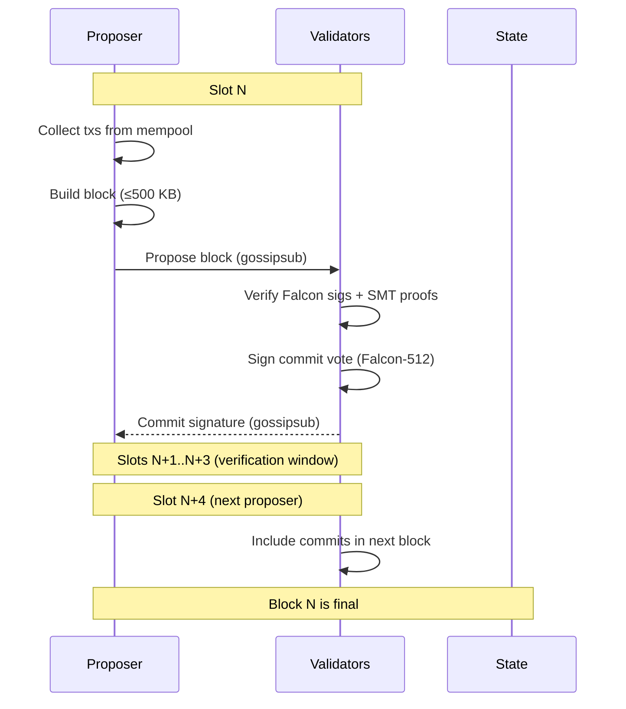

# Consensus

## Overview

Proof of Stake consensus with a fixed 5-second block time and 20-second finality.

## Parameters

| Parameter          | Value      | Notes                                 |
| ------------------ | ---------- | ------------------------------------- |
| Type               | PoS        |                                       |
| Block time         | 5s         | Fixed, not variable                   |
| Finality           | ~20s       | 4 blocks (BFT commit)                |
| Block size         | 500 KB     | Hard cap                              |
| Finality mechanism | BFT commit | Per-block, 2/3+ validator sigs        |
| Era length         | 720 blocks | ~1 hour — validator set recalculation |

## Eras

An era is the period between **validator set recalculations**. Every N blocks, the election runs again.

```
Era boundary (block % 720 == 0):
  1. Snapshot candidate pool
  2. Run ValidatorElection::elect()
  3. Commit new active set to state
  4. Reset proposer schedule
```

### Era 0 (Bootstrap)

Era 0 has no stake requirement — any registered key participates and earns MONEX. After era 0 ends, normal Top-N election takes over.

```rust
pub enum ElectionMode {
    /// Era 0 only: no minimum stake
    Open,
    /// Era 1+: standard Top-N by stake
    TopN { max_validators: usize },
}
```

### What changes at era boundaries

| Element              | Changes? | Notes                     |
| -------------------- | -------- | ------------------------- |
| Active validator set | ✅ Yes   | New election result       |
| Proposer schedule    | ✅ Yes   | Resets with new set       |
| Block production     | ❌ No    | Continuous                |
| Mempool              | ❌ No    | Continuous                |
| Finality             | ❌ No    | Continuous                |
| Staking balances     | ❌ No    | Changes apply immediately |

## Finality: BFT Commit Per Block

After a block is proposed, validators verify and submit a signed commit vote. Once 2/3+ of the active set commits, the block is final.

```
slot 0: V1 proposes Block A → validators verify + vote
slot 1-3: verification window (validators verify Falcon-512 sigs, state, SMT)
slot 4: V2 proposes Block B (includes commit proofs from slot 0) → A is final
```

- Commits are included in the _next_ block header as proof
- A block is final as soon as 2/3+ commits for it appear on-chain
- In practice: **~20s (4 blocks)** — proposer submits, validators have 3 blocks to verify and submit commit votes
- The 20s verification window accounts for Falcon-512 signature verification (~10x slower than Ed25519) and SMT validation

## Flow



## Commit Format (Sketch)

```
CommitVote {
    block_hash: [u8; 32],
    validator: ValidatorId,
    signature: [u8; 666],       // Falcon-512
}
```

## Forks

If a proposer equivocates (proposes two blocks at the same slot), validators:

1. Reject duplicates at the protocol level
2. **Slash** the validator — lose 90% of stake
3. The **reporter** (validator who submitted the evidence) receives a **10% bounty** of the slashed amount
4. The next honest proposer resolves the fork

### Slashing Details

| Dimension        | Value          |
| ---------------- | -------------- |
| **Equivocation** | 90% of stake burned |
| **Liveness**     | Not slashed in V1 (replaced at era boundary if inactive) |
| **Reporting**    | Any validator submits evidence tx; receives 10% bounty |
| **Evidence topic** | Gossiped on `mononium/evidence/{chain_id}` |
| **Unstaking cooldown** | 7 days (constant, prevents gaming after violations) |

Slashing evidence is a self-contained message proving the equivocation (two signed blocks from the same proposer at the same height). Any validator can submit it as an evidence transaction. Detection is automatic — validators see both blocks arrive via gossipsub.

## Future: GRANDPA (V2.0+)

GRANDPA can be added as an alternative finality gadget via the same DI pattern. It finalizes many blocks at once, which is useful for larger validator sets or when network latency varies.

## Throughput

TPS is not a fixed target — it emerges from:

```
TPS ≈ block size / avg tx size / block time
```

With Falcon-512 signatures (666 bytes per tx), realistic tx sizes are larger than the original Ed25519 estimates:

| Tx Size | TPS (approx) |
| ------- | ------------ |
| 500 B   | ~200         |
| 800 B   | ~125         |
| 1 KB    | ~100         |
| 1.5 KB  | ~66          |

Realistic V1 throughput: **100-200 TPS** with Falcon-512 signatures, which aligns with the "Cheap Validators First" philosophy.

## Mempool

Transaction pool ordering:

| Priority | Field         | Order          | Why                |
| -------- | ------------- | -------------- | ------------------ |
| 1        | Tip           | Highest first  | Economic incentive |
| 2        | Time received | Earliest first | Fairness           |
| 3        | Nonce         | Lowest first   | Prevent nonce gaps |

```rust
pub struct MempoolConfig {
    pub max_size: usize,     // 10,000
    pub ttl: Duration,       // 10 minutes
    pub min_fee: U256,       // local filter — not a consensus parameter
}
```

The `min_fee` is a local node policy. Each operator sets their own threshold (default: `0.0667 MONEX`). A tx below this fee is rejected from the local mempool but is still valid if included by another validator. This lets operators tune their own spam tolerance without affecting consensus.

The proposer selects the highest-priority txs for their block up to the 500 KB limit.

## Validator Election

Validators are elected via **Top-N by stake** (see [Validators](Validators.md#Validator Election)). The election algorithm is swappable via dependency injection for future Phragmén support.

## Block Production

### V1: Round-Robin

Active validators take turns proposing blocks in a fixed order. The proposer schedule is deterministic:

```
slot 0: validator_1
slot 1: validator_2
slot 2: validator_3
slot 3: validator_4
slot 4: validator_1  (cycles)
...
```

- Order is determined at era boundaries (when active set is elected)
- All validators can compute the proposer for any slot independently
- Simple, predictable, easy to debug with Docker

### Future: VRF Leader Election (V2.0+)

Randomized proposer selection via Verifiable Random Function. Each validator runs VRF each slot; lowest output wins.

### Missed Slots

If the proposer for a slot is offline, the **slot goes empty**:

- After 5s (block time elapses) with no block from the expected proposer, validators do nothing
- No votes are cast (nothing to vote on)
- The next proposer in the round-robin schedule builds on the last canonical block
- Height increments only when a block is actually proposed

Example:
```
slot  0: V1 proposes Block 10  ✓
slot  1: V2 is offline          → empty slot
slot  2: V3 proposes Block 11  ✓  (builds on Block 10)
slot  3: V4 proposes Block 12  ✓
```

**No liveness penalty** — V1 has no liveness slashing. An inactive validator will be replaced at the next era boundary if their stake drops below the Top-N threshold.

### DI Pattern

Same trait-based approach as [Validators](Validators.md#Validator Election):

```rust
#[async_trait]
pub trait ProposerSelection: Send + Sync {
    fn select_proposer(&self, slot: u64, active_set: &[ValidatorId]) -> ValidatorId;
}

pub struct RoundRobin;
impl ProposerSelection for RoundRobin {
    fn select_proposer(&self, slot: u64, active_set: &[ValidatorId]) -> ValidatorId {
        active_set[slot as usize % active_set.len()]
    }
}
```

```rust
ConsensusConfig {
    election: Box::new(TopNElection),
    proposer: Box::new(RoundRobin),
    block_time: Duration::from_secs(5),
    epoch_length: 720,
}
```

## Consensus Overhead Includes

- Message propagation
- Falcon-512 signature verification (batch where possible)
- State validation per block (SMT verification)

## Attack Resistance

- **Nothing at stake**: Addressed via slashing (90% equivocation penalty)
- **Long-range attack**: To be addressed (key-evolving signatures or checkpointing)
- **Censorship**: Multiple proposers via round-robin or VRF selection

---

**Related:** [Validators](plans/V0.3.0/Validators.md), [Protocol](plans/V0.3.0/Protocol.md)
