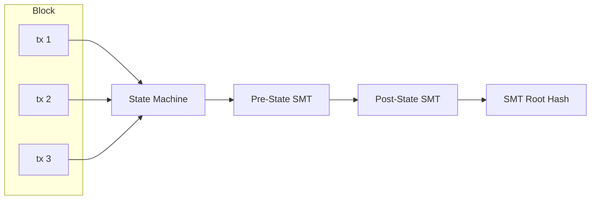

# Protocol

## Serialization

| Layer                                 | Format                     | Why                              |
| ------------------------------------- | -------------------------- | -------------------------------- |
| **Wire protocol** (blocks, tx, votes) | SCALE (parity-scale-codec) | Compact, fast, derive-based      |
| **State storage** (redb rows)         | SCALE                      | Same as wire — consistent        |
| **RPC** (API responses)               | JSON (serde)               | Human-readable, standard clients |

```rust
// One struct, both formats via dual derives
#[derive(Encode, Decode, Serialize, Deserialize)]
pub struct Transaction {
    pub sender: [u8; 32],
    pub nonce: u64,
    // ... fields derive both SCALE + JSON serialization
}
```

## State Model

Account-based (not UTXO). Addresses map directly to account objects. State is committed via a Sparse Merkle Tree (see [State Root](#state-root)).

```
Account {
    address: [u8; 32],
    balance: U256,
    nonce: u64,
    code_hash: Option<[u8; 32]>,  // for future smart contracts
}
```

## Transaction Types (V1)

1. **Transfer** — Move MONEX between accounts
2. **RegisterValidator** — Declare intent to validate (one-time, prerequisite for staking)
3. **Stake** — Lock MONEX to become/activate a validator (requires prior registration)
4. **RegisterAndStake** — Convenience: registers + stakes atomically for new validators
5. **Unstake** — Begin withdrawal from validator set (7-day cooldown)

## Transaction Format (Sketch)

All protocol signatures use **Falcon-512** (666 bytes).

```
Transaction {
    chain_id: u64,           // replay protection
    nonce: u64,              // account nonce
    sender: [u8; 32],        // source address
    recipient: [u8; 32],     // destination address
    amount: U256,            // value transfer
    fee: U256,               // transaction fee
    tx_type: u8,             // transfer, stake, etc.
    payload: Option<Vec<u8>>, // additional data
    signature: [u8; 666],    // Falcon-512 signature
}
```

## Block Structure (Sketch)

```
Block {
    header: BlockHeader,
    transactions: Vec<Transaction>,
    votes: Vec<CommitVote>,
}

BlockHeader {
    height: u64,
    parent_hash: [u8; 32],
    state_root: [u8; 32],        // Sparse Merkle Tree root (single commitment over all namespaces)
    tx_root: [u8; 32],           // BLAKE3 Merkle root of transaction hashes
    timestamp: u64,
    proposer_index: u16,         // index into the current era's active validator set
    chain_id: u64,
}
```

Note: No block-level compression. Blocks are always serialized as raw SCALE bytes. Transport-layer compression (snappy) is handled by libp2p.

## State Root

The state root is computed via a **256-depth Sparse Merkle Tree** using **BLAKE3** as the hash function.

### Namespaces

The SMT uses a single tree with 3 namespaces:

| Prefix | Namespace  | Contents                                                                 |
| ------ | ---------- | ------------------------------------------------------------------------ |
| `0x00` | Accounts   | `Address → (balance: U256, nonce: u64, code_hash: Option<[u8;32]>)`      |
| `0x01` | Validators | `PublicKey → (stake: U256, status: u8)`                                  |
| `0x02` | Meta       | Chain-global state: height, era, active set hash, chain_id, total supply |

Namespacing is implemented via key prefixing: account keys are stored as `0x00 ++ address`, validator keys as `0x01 ++ pubkey`, meta keys as `0x02 ++ key_id`.

### Implementation

```rust
// mononium-rust-lib/src/crypto/trie.rs
pub trait Trie {
    fn get(&self, key: &[u8]) -> Option<Vec<u8>>;
    fn insert(&mut self, key: &[u8], value: Vec<u8>);
    fn root(&self) -> [u8; 32];
    fn prove(&self, key: &[u8]) -> MerkleProof;  // for future light clients
}
```

The SMT is a custom implementation in `mononium-rust-lib`. No external trie dependency. The implementation only needs insert, get, root, and prove for V1.

## State Transition



- Transactions are applied in order within a block
- Each tx is validated (signature, nonce, balance) before execution
- State root after block = SMT root committing to full state
- Re-execute any block → deterministic state

## Transaction Fees

Fee per transaction = **flat component** + **size component** + **optional tip**

```rust
pub struct HybridFee {
    pub flat_fee: U256,         // 0.00667 MONEX — minimum cost per tx
    pub per_byte_rate: U256,    // 0.000467 MONEX/byte — proportional to size
    // tip is set by sender as part of Transaction
}
```

| Component | Value              | Purpose                               | Set by             |
| --------- | ------------------ | ------------------------------------- | ------------------ |
| Flat fee  | **0.00667 MONEX**  | Minimum cost per tx (spam prevention) | Protocol parameter |
| Per-byte  | **0.000467 MONEX** | Proportional to state/storage cost    | Protocol parameter |
| Tip       | User-defined       | Priority for block inclusion          | Sender             |

```rust
impl FeePolicy for HybridFee {
    fn calculate_fee(&self, tx: &Transaction) -> U256 {
        // Protocol enforces correct fee calculation
        self.flat_fee + self.per_byte_rate * U256::from(tx.encoded_size()) + tx.tip
    }
}
```

These values are the same across all network tiers (Localnet, Devnet, Testnet, Mainnet). Swappable via `FeePolicy` trait.

**Note on `min_fee`:** The mempool has a `min_fee` threshold (`0.0667 MONEX`) — this is a **local node policy**, not a consensus parameter. Each operator sets their own filter in `config.yaml`. A tx below `min_fee` is rejected from the local mempool but would still be valid in a block proposed by another validator. See [Mempool](../Consensus.md#Mempool).

## Genesis

### Genesis File Format

Each network tier has a JSON genesis file committed to the repo:

```bash
mononium-cli node --genesis configs/genesis.localnet.json
```

```json
{
  "chain_id": 0,
  "genesis_time": "2026-06-17T00:00:00Z",
  "initial_height": 0,
  "consensus": {
    "block_time_sec": 5,
    "era_length": 720,
    "max_validators": 21,
    "election_mode": "Open"
  },
  "accounts": [
    { "address": "0x...", "balance": "100_000_000_000_000_000_000" }
  ],
  "bootstrap": {
    "public_key": "0x...",
    "blocks": 20
  }
}
```

### Loading Logic

1. Node checks for existing redb database file
2. If database exists → genesis already applied, skip
3. If database doesn't exist → parse genesis JSON, build initial SMT, create block 0 (genesis block)
4. Genesis block hash = BLAKE3 of block 0 header — any peer with a different genesis rejects connections

### Genesis Files

| File                            | Network  | Supply                       | Validators                                            |
| ------------------------------- | -------- | ---------------------------- | ----------------------------------------------------- |
| `configs/genesis.localnet.json` | Localnet | 10 MONEX (1 key)             | Bootstrap only (1 block)                              |
| `configs/genesis.devnet.json`   | Devnet   | 100 MONEX per key (3-5 keys) | Bootstrap (20 blocks) → era 0 Open                    |
| `configs/genesis.testnet.json`  | Testnet  | 100 MONEX                    | Bootstrap (100 blocks) → era 0 Open                   |
| `configs/genesis.mainnet.json`  | Mainnet  | 0 MONEX                      | Bootstrap (100 blocks) → era 0 Open + CappedInflation |

## Token Supply

### Dev Networks (Localnet/Devnet/Testnet): Fixed Supply

All MONEX are minted at genesis. No inflation, no block rewards. Validators earn only transaction fees.

### Mainnet: Capped Inflation

Mainnet starts at 0 total supply. MONEX is minted via block rewards with a capped maximum supply. Validators earn **transaction fees + block rewards**.

```rust
pub trait SupplyPolicy: Send + Sync {
    fn block_reward(&self, height: u64) -> U256;
}

pub struct FixedSupply;
impl SupplyPolicy for FixedSupply {
    fn block_reward(&self, _height: u64) -> U256 {
        U256::zero() // no inflation
    }
}

pub struct CappedInflation {
    max_supply: U256,     // 10,000,000,000 MONEX (cap on minted supply)
    annual_rate: f64,     // 0.035 = 3.5%
}
impl SupplyPolicy for CappedInflation {
    fn block_reward(&self, height: u64) -> U256 { ... }
}

**Parameters:**

| Parameter | Value | Notes |
|-----------|-------|-------|
| Annual rate | **3.5%** | Applied to current effective max supply |
| Base cap | **10,000,000,000 MONEX** | Hard floor on minted supply |
| Effective max | `10B + cap_refill_balance` | Recalculated at each era boundary |
| Burn coins | Permanently destroyed | No effect on cap |

**Effective max supply:**

The total minting cap = `base_cap + cap_refill_balance`. The `cap_refill_balance` is the amount of MONEX held at the Cap-Refill address (`0x00..01`). Anyone can voluntarily send MONEX there — coins are a sink (irreversible).

**Applied at era boundaries:** At each era transition (block % 720 == 0), the consensus engine snapshots the Cap-Refill balance and recomputes the effective max. Block rewards for the next era use this updated value. This prevents mid-era supply changes from breaking block reward determinism.

**Formula (per block, constant within an era):**

```

block_reward = effective_max \* annual_rate / blocks_per_year

```

**Example:**
```

Year 1: effective_max = 10B, block_reward ≈ 55.5 MONEX/block
Year 10: 3.5B minted, cap_refill = 100M → effective_max = 10.1B, block_reward ≈ 56.1 MONEX/block
Year 28: 10B minted, cap_refill = 500M → effective_max = 10.5B, inflation continues at adjusted rate

```

**Consequences:**
- Inflation naturally ends around year 28 (with no cap_refill)
- Cap-Refill contributions extend the tail gradually
- No mid-era surprises — deterministic within each era
```

Swappable via `ConsensusConfig { supply: Box<dyn SupplyPolicy> }`. The CLI config for Dev networks injects `FixedSupply`; the Mainnet config injects `CappedInflation`.

### Future Treasury (V2.0+)

A portion of inflation can be diverted to a treasury/development fund, governed by on-chain voting.

## Chain ID

Each network gets a unique chain ID to prevent replay attacks across networks:

| Network  | Chain ID |
| -------- | -------- |
| Localnet | 0        |
| Devnet   | 1        |
| Testnet  | 2        |
| Mainnet  | 3        |

---

**Related:** [Architecture](plans/V0.3.0/Architecture.md), [Consensus](plans/V0.3.0/Consensus.md), [Network](plans/V0.3.0/Network.md)
