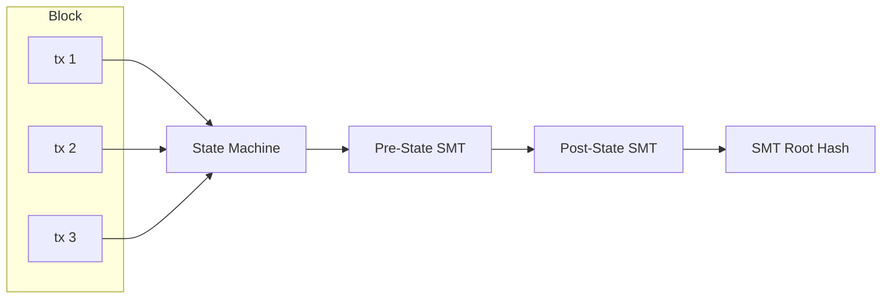

# Protocol

## Serialization

| Layer                                 | Format                     | Why                              |
| ------------------------------------- | -------------------------- | -------------------------------- |
| **Wire protocol** (blocks, tx, votes) | SCALE (parity-scale-codec) | Compact, fast, derive-based      |
| **State storage** (redb rows)         | SCALE                      | Same as wire — consistent        |
| **RPC** (API responses)               | JSON (serde)               | Human-readable, standard clients |

```rust
// One struct, both formats via dual derives
#[derive(Encode, Decode, Serialize, Deserialize)]
pub struct Transaction {
    pub sender: [u8; 32],
    pub nonce: u64,
    // ... fields derive both SCALE + JSON serialization
}
```

## State Model

Account-based (not UTXO). Addresses map directly to account objects. State is committed via a Sparse Merkle Tree (see [State Root](#state-root)).

```
Account {
    address: [u8; 32],
    balance: U256,
    nonce: u64,
    code_hash: Option<[u8; 32]>,  // for future smart contracts
}
```

## Transaction Types (V1)

1. **Transfer** — Move MONEX between accounts
2. **RegisterValidator** — Declare intent to validate (one-time, prerequisite for staking)
3. **Stake** — Lock MONEX to become/activate a validator (requires prior registration)
4. **RegisterAndStake** — Convenience: registers + stakes atomically for new validators
5. **Unstake** — Begin withdrawal from validator set (7-day cooldown)
6. **Burn** — Send MONEX to `0x00..00` (permanent destruction) or `0x00..01` (Cap-Refill sink). Flat fee 10 MOXX regardless of amount — incentivizes voluntary supply reduction.

## Transaction Format

All protocol signatures use **Falcon-512** (666 bytes).

### Envelope (common to all tx types)

```rust
struct Transaction {
    chain_id: u64,
    nonce: u64,
    sender: [u8; 32],
    fee: U256,
    body: TxBody,               // SCALE enum — 1 byte variant + type-specific fields
    signature: [u8; 666],       // over SCALE of (chain_id || nonce || sender || fee || body)
}
```

### TxBody Enum

```rust
enum TxBody {
    Transfer { recipient: [u8; 32], amount: U256 },
    RegisterValidator,                                    // just the variant, no extra fields
    Stake { validator: [u8; 32], amount: U256 },
    RegisterAndStake { validator: [u8; 32], amount: U256 },
    Unstake { validator: [u8; 32], amount: U256 },
    Burn { target: BurnTarget, amount: U256 },
}

enum BurnTarget {
    Permanent,   // 0x00..00
    CapRefill,   // 0x00..01
}
```

## Block Structure

```rust
struct Block {
    header: BlockHeader,
    body: BlockBody,
}

struct BlockHeader {
    height: u64,
    parent_hash: [u8; 32],
    state_root: [u8; 32],        // SMT root (single commitment over all namespaces → per-shard roots)
    tx_root: [u8; 32],           // BLAKE3 Merkle root of all transaction hashes
    timestamp: u64,
    proposer: [u8; 32],          // validator address — self-describing, no era context needed
    chain_id: u64,
}

struct BlockBody {
    transactions: Vec<Transaction>,  // SCALE vector (compact length prefix + items)
}
```

**Votes** are not included in the block. They are gossipped and stored independently in the `block_votes` database table. See [Storage](./Storage.md).

**tx_root** is a BLAKE3 Merkle tree over the individual BLAKE3 hashes of each transaction. The leaves are `blake3(SCALE(tx))` for each tx in order. This enables future light client proofs (prove a tx is in a block without the full block body).

Note: No block-level compression. Blocks are always serialized as raw SCALE bytes. Transport-layer compression (snappy) is handled by libp2p.

### Commit Vote

```rust
struct CommitVote {
    height: u64,
    block_hash: [u8; 32],
    validator: [u8; 32],
    signature: [u8; 666],       // Falcon-512 over SCALE(height || block_hash)
}
```

Votes are not included in blocks. They are gossipped on `mononium/votes/{chain_id}` and stored in the `block_votes` DB table keyed by height.

## State Root

The state root is computed via a **256-depth Sparse Merkle Tree** using **BLAKE3** as the hash function.

### Namespaces

The SMT uses a single tree with 3 namespaces:

| Prefix | Namespace  | Contents                                                                 |
| ------ | ---------- | ------------------------------------------------------------------------ |
| `0x00` | Accounts   | `Address → (balance: U256, nonce: u64, code_hash: Option<[u8;32]>)`      |
| `0x01` | Validators | `PublicKey → (stake: U256, status: u8)`                                  |
| `0x02` | Meta       | Chain-global state: height, era, active set hash, chain_id, total supply |

Namespacing is implemented via key prefixing: account keys are stored as `0x00 ++ address`, validator keys as `0x01 ++ pubkey`, meta keys as `0x02 ++ key_id`.

### Implementation

```rust
// mononium-rust-lib/src/crypto/trie.rs
pub trait Trie {
    fn get(&self, key: &[u8]) -> Option<Vec<u8>>;
    fn insert(&mut self, key: &[u8], value: Vec<u8>);
    fn root(&self) -> [u8; 32];
    fn prove(&self, key: &[u8]) -> MerkleProof;  // for future light clients
}
```

The SMT is a custom implementation in `mononium-rust-lib`. No external trie dependency. The implementation only needs insert, get, root, and prove for V1.

## State Transition



- Transactions are applied **in order** within a block
- Each tx is validated (signature, nonce, balance) before execution
- **Failed transactions:** skip-and-continue — the tx is skipped, but the **fee is still paid** (added to the block fee pool for pro-rata distribution). This prevents spam (failed txs still cost MONEX) while keeping block production resilient to individual tx failures.
- State root after block = SMT root committing to full state
- Re-execute any block → deterministic state

## Transaction Fees

### Standard Fees

Fee per transaction = **flat component** + **size component** + **optional tip**

```rust
pub struct HybridFee {
    pub flat_fee: U256,         // 0.00667 MONEX — minimum cost per tx
    pub per_byte_rate: U256,    // 0.000467 MONEX/byte — proportional to size
    // tip is set by sender as part of Transaction
}
```

| Component | Value              | Purpose                               | Set by             |
| --------- | ------------------ | ------------------------------------- | ------------------ |
| Flat fee  | **0.00667 MONEX**  | Minimum cost per tx (spam prevention) | Protocol parameter |
| Per-byte  | **0.000467 MONEX** | Proportional to state/storage cost    | Protocol parameter |
| Tip       | User-defined       | Priority for block inclusion          | Sender             |

```rust
impl FeePolicy for HybridFee {
    fn calculate_fee(&self, tx: &Transaction) -> U256 {
        match &tx.body {
            TxBody::Burn { .. } => U256::from(10),  // 10 MOXX flat
            _ => self.flat_fee + self.per_byte_rate * U256::from(tx.encoded_size()) + tx.tip,
        }
    }
}

Burn transactions bypass standard fee calculation — flat **10 MOXX** regardless of size or tip.

These values are the same across all network tiers (Localnet, Devnet, Testnet, Mainnet). Swappable via `FeePolicy` trait.

**Note on `min_fee`:** The mempool has a `min_fee` threshold (`0.0667 MONEX`) — this is a **local node policy**, not a consensus parameter. Each operator sets their own filter in the node config file. A tx below `min_fee` is rejected from the local mempool but would still be valid in a block proposed by another validator. See [NodeConfig](./NodeConfig.md#mempoolmin_fee) and [Mempool](../Consensus.md#Mempool).

**Block hard cap:** 500 txs OR 1 MB per block. With the per-account rate limit of 50 txs/block, at least 10 distinct accounts are needed to fill a block. Batch operations (e.g., distributing to 200 recipients) will span multiple blocks (~20s at 5s block time). Wallet and tooling developers should account for this when designing batch workflows.

### Anti-Spam Deposit

Every transaction requires a **1 MONEX deposit** per tx, deducted from the sender's balance and held until the era boundary. This is the primary anti-spam mechanism — the capital cost scales proportionally with volume (100 burn txs = 100 MONEX temporarily locked).

- **Per transaction:** Each tx locks 1 MONEX from the sender's balance for the remainder of the current era
- **Auto-return:** All deposits are returned to the sender's balance at the **era boundary** (block % 720 == 0). No explicit reclaim tx needed
- **No exemption:** Burn txs also lock 1 MONEX — the 10 MOXX fee covers processing, but the deposit still applies
- **Capital cost example:** An account submitting 50 txs in one era has 50 MONEX temporarily locked. At the era boundary, all 50 return to the sender's available balance
- **Observer nodes:** No deposit needed (no tx submission)
- **Dev networks:** 1 MONEX per tx is trivial on Devnet (100 MONEX/key) but enforced for consistency
- **Rate limit:** Pair with the per-account rate limit (50 txs/block) — the deposit is economic anti-spam, the rate limit prevents block congestion

The per-tx deposit combined with the per-block rate limit creates two independent anti-spam layers. An attacker needs both significant capital (deposits) and multiple accounts (rate limit) to congest the network.

## Fee Distribution

Collected fees are **not** kept by the proposer. Instead, they are distributed **pro-rata by stake** across **all active validators** at the end of each block.

### Distribution Mechanics

```
Block applied with N transactions
  → total_fees = sum of all tx fees in the block
  → total_active_stake = sum of all active validators' stake
  → For each active validator V:
      V's share = total_fees * (V.stake / total_active_stake)
      V's balance += V's share
```

**When it happens:** At the end of `apply_block()`, after all transactions have been processed (including failed ones that still paid fees), before computing the new state root.

**What gets distributed:** Every fee component — flat_fee + per_byte + tip. All three are pooled and split identically. Nothing is kept by the proposer beyond their pro-rata share based on their own stake.

**Where fees go:** Each validator's share is added to their **transferable balance** (not their stake). Validators can choose to withdraw, transfer, or re-stake their fee earnings.

**What about the proposer?** The proposer receives their pro-rata share like every other active validator. They are not special — their proposer role does not entitle them to extra fee income beyond what their stake weight dictates.

### State Machine Detail

The state machine maintains a **fee accumulator** per block:

```
1. Initialize block_fees = 0
2. For each tx in the block (processed in order):
     a. Validate tx (signature, nonce, balance, fee sufficiency)
     b. If valid:
          - Deduct fee from sender's balance
          - Execute the transaction (transfer, stake, etc.)
          - block_fees += fee
     c. If invalid:
          - Skip execution
          - Deduct fee from sender's balance (failed txs still pay)
          - block_fees += fee
3. After all txs processed:
     a. total_active_stake = sum of all stakes in active validator set
     b. For each active validator V with stake S_V:
          V.balance += block_fees * S_V / total_active_stake
4. Compute new state root (includes updated balances)
```

**Precision:** All division uses integer arithmetic with U256. To handle rounding, the fee distribution must distribute the full `block_fees` across validators without losing wei to truncation. Implementation strategy: distribute using `block_fees * stake / total_stake` for each validator, then allocate the remainder (due to integer truncation) to the validator with the highest stake. This guarantees the full fee pool is distributed each block.

### Comparison to Options Considered

| Option | Description | Chosen? | Why rejected |
|--------|------------|---------|-------------|
| A | Proposer keeps 100% of fees | ❌ | Creates feast-or-famine reward pattern; non-proposing validators earn nothing for 105s on a 21-set |
| B | Split equally among active set | ❌ | Ignores stake weight; a 1 MONEX validator earns the same as a 1,000 MONEX validator |
| **C** | **Split pro-rata by stake** | **✅** | Rewards commitment proportionally; all validators earn every block; no special proposer bonus needed |

## Genesis

### Genesis File Format

Each network tier has a JSON genesis file committed to the repo:

```bash
mononium-cli node --genesis configs/genesis.localnet.json
```

```json
{
  "chain_id": 0,
  "genesis_time": "2026-06-17T00:00:00Z",
  "initial_height": 0,
  "consensus": {
    "block_time_sec": 5,
    "era_length": 720,
    "max_validators": 21,
    "election_mode": "Open"
  },
  "accounts": [
    { "address": "0x...", "balance": "100000000000000000000000000000000000" }
  ]
  "bootstrap": {
    "public_key": "0x...",
    "blocks": 20
  }
}
```

### Loading Logic

1. Node checks for existing redb database file
2. If database exists → genesis already applied, skip
3. If database doesn't exist → parse genesis JSON, build initial SMT, create block 0 (genesis block)
4. Genesis block hash = BLAKE3 of block 0 header — any peer with a different genesis rejects connections

### Genesis Files

| File                            | Network  | Supply                       | Validators                                            |
| ------------------------------- | -------- | ---------------------------- | ----------------------------------------------------- |
| `configs/genesis.localnet.json` | Localnet | 10 MONEX (1 key)             | Bootstrap only (1 block)                              |
| `configs/genesis.devnet.json`   | Devnet   | 100 MONEX per key (3-5 keys) | Bootstrap (20 blocks) → era 0 Open                    |
| `configs/genesis.testnet.json`  | Testnet  | 100 MONEX                    | Bootstrap (100 blocks) → era 0 Open                   |
| `configs/genesis.mainnet.json`  | Mainnet  | 0 MONEX                      | Bootstrap (100 blocks) → era 0 Open + CappedInflation |

## Denomination

| Unit   | Value         | Notes                     |
| ------ | ------------- | ------------------------- |
| MONEX  | 1             | Primary unit (display)    |
| MOXX   | 10^−32 MONEX  | Smallest unit, "moss"     |

1 MONEX = 10^32 MOXX. All on-chain amounts are stored as MOXX (U256). Display formatting divides by 10^32.

Constants for code:
```rust
const ONE_MONEX: U256 = U256::from_str("100000000000000000000000000000000"); // 10^32
const ONE_MOXX: U256 = U256::one();
```

## Token Supply

### Dev Networks (Localnet/Devnet/Testnet): Fixed Supply

All MONEX are minted at genesis. No inflation, no block rewards. Validators earn only transaction fees.

### Mainnet: Capped Inflation

Mainnet starts at 0 total supply. MONEX is minted via block rewards with a capped maximum supply. Validators earn **transaction fees + block rewards**.

```rust
pub trait SupplyPolicy: Send + Sync {
    fn block_reward(&self, height: u64) -> U256;
}

pub struct FixedSupply;
impl SupplyPolicy for FixedSupply {
    fn block_reward(&self, _height: u64) -> U256 {
        U256::zero() // no inflation
    }
}

pub struct CappedInflation {
    max_supply: U256,     // 10,000,000,000 MONEX in MOXX (10^10 × 10^32)
    annual_rate: f64,     // 0.035 = 3.5%
}
impl SupplyPolicy for CappedInflation {
    fn block_reward(&self, height: u64) -> U256 { ... }
}

**Parameters:**

| Parameter | Value | Notes |
|-----------|-------|-------|
| Annual rate | **3.5%** | Applied to current effective max supply |
| Base cap | **10,000,000,000 MONEX** | Hard floor on minted supply |
| Effective max | `10B + cap_refill_balance` | Recalculated at each era boundary |
| Burn coins | Permanently destroyed | No effect on cap |

**Effective max supply:**

The total minting cap = `base_cap + cap_refill_balance`. The `cap_refill_balance` is the amount of MONEX held at the Cap-Refill address (`0x00..01`). Anyone can voluntarily send MONEX there — coins are a sink (irreversible).

**Applied at era boundaries:** At each era transition (block % 720 == 0), the consensus engine snapshots the Cap-Refill balance and recomputes the effective max. Block rewards for the next era use this updated value. This prevents mid-era supply changes from breaking block reward determinism.

**Formula (per block, constant within an era):**

```

block_reward = effective_max \* annual_rate / blocks_per_year

```

**Example:**
```

Year 1: effective_max = 10B, block_reward ≈ 55.5 MONEX/block
Year 10: 3.5B minted, cap_refill = 100M → effective_max = 10.1B, block_reward ≈ 56.1 MONEX/block
Year 28: 10B minted, cap_refill = 500M → effective_max = 10.5B, inflation continues at adjusted rate

```

**Consequences:**
- Inflation naturally ends around year 28 (with no cap_refill)
- Cap-Refill contributions extend the tail gradually
- No mid-era surprises — deterministic within each era
```

Swappable via `ConsensusConfig { supply: Box<dyn SupplyPolicy> }`. The CLI config for Dev networks injects `FixedSupply`; the Mainnet config injects `CappedInflation`.

### Future Treasury (V2.0+)

A portion of inflation can be diverted to a treasury/development fund, governed by on-chain voting.

## Chain ID

Each network gets a unique chain ID to prevent replay attacks across networks:

| Network  | Chain ID |
| -------- | -------- |
| Localnet | 0        |
| Devnet   | 1        |
| Testnet  | 2        |
| Mainnet  | 3        |

---

**Related:** [Architecture](plans/V0.4.0/Architecture.md), [Consensus](plans/V0.4.0/Consensus.md), [Network](plans/V0.4.0/Network.md)
