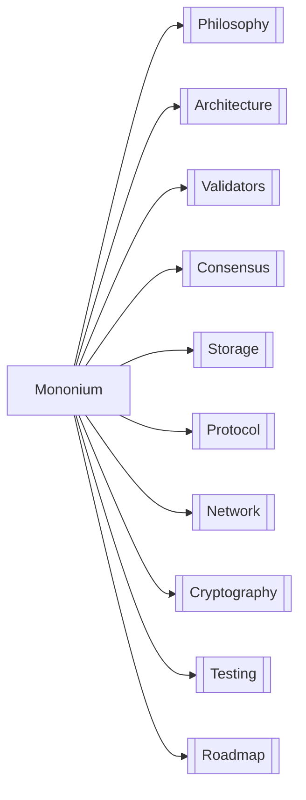

# Mononium — L1 Blockchain

**Mononium** is a Layer 1 blockchain built in Rust. Native token is **Monium (MONEX)**.

| Area            | Doc                                          | Key Decisions                                    |
| --------------- | -------------------------------------------- | ------------------------------------------------ |
| 🧠 Philosophy   | [Philosophy](plans/V0.5.0/Philosophy.md)     | Account-based, minimalism, Falcon-512, redb      |
| 🏗️ Architecture | [Architecture](plans/V0.5.0/Architecture.md) | Cargo workspace: lib + CLI + GUI, SMT state root |
| 👥 Validators   | [Validators](plans/V0.5.0/Validators.md)     | Cheap VPS target, PoS, 90% equivocation slashing |
| ⚡ Consensus    | [Consensus](plans/V0.5.0/Consensus.md)       | PoS, 5s block, 20s finality, BFT commit          |
| 💾 Storage      | [Storage](plans/V0.5.0/Storage.md)           | redb, mutable + append-only, key mgmt            |
| 📋 Protocol     | [Protocol](plans/V0.5.0/Protocol.md)         | Account model, Falcon-512 sigs, native tx first  |
| 🌐 Network      | [Network](plans/V0.5.0/Network.md)           | libp2p gossipsub, 4 topics, snappy compression   |
| 🔐 Cryptography | [Cryptography](plans/V0.5.0/Cryptography.md) | Falcon-512, BLAKE3, Argon2id key storage         |
| 🧪 Testing      | [Testing](plans/V0.5.0/Testing.md)           | 5-tier pyramid, src/tests/ mirrors src/          |
| 🗺️ Roadmap      | [Roadmap](plans/V0.5.0/Roadmap.md)           | 5 phases, benchmark early                        |

---

> **Next:** Start with [Philosophy](plans/V0.5.0/Philosophy.md) to understand the design rationale.
