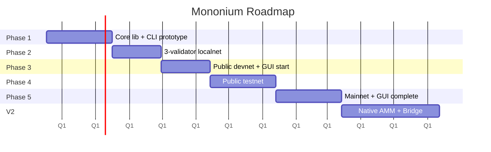
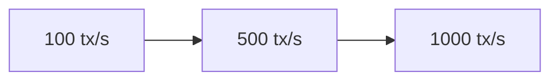

# Roadmap

## Phases



## Phase 1 — Workspace Setup + Local Prototype

Ship `mononium-rust-lib` + `mononium-cli` first. GUI starts later.

- [ ] Cargo workspace: `mononium-rust-lib` + `mononium-cli`
- [ ] `mononium-rust-lib`: account types, U256, state machine
- [ ] `mononium-rust-lib`: Falcon-512 signing + BLAKE3 hashing
- [ ] `mononium-rust-lib`: redb (mutable + append-only)
- [ ] `mononium-rust-lib`: Sparse Merkle Tree implementation
- [ ] `mononium-rust-lib`: transaction types + SCALE/JSON serialization
- [ ] `mononium-rust-lib`: block structure + hashing
- [ ] `mononium-rust-lib`: basic mempool
- [ ] `mononium-cli`: node daemon (single-node mode)
- [ ] `mononium-cli`: wallet keygen (Falcon-512), transfer command

**Goal:** `mononium-cli node` produces blocks locally. `mononium-cli wallet transfer` sends txs.

## Phase 2 — Localnet

- [ ] `mononium-rust-lib`: P2P networking + peer discovery
- [ ] `mononium-rust-lib`: PoS consensus engine
- [ ] `mononium-rust-lib`: staking transaction types
- [ ] `mononium-cli`: multi-validator node mode
- [ ] `mononium-cli`: stake/unstake commands
- [ ] Block propagation and consensus votes
- [ ] Crash recovery and snapshots
- [ ] Benchmarks: 100 tx/s target

**Goal:** 3+ validators on local machine or cheap VPS.

## Phase 3 — Devnet + GUI Begins

- [ ] Public devnet deployment
- [ ] Genesis file + chain ID management
- [ ] Seed/bootstrap nodes
- [ ] Sync / catch-up mechanism
- [ ] Benchmarks: 500 tx/s target
- [ ] **Add `mononium-gui` to workspace**
- [ ] `mononium-gui`: connect to node via RPC
- [ ] `mononium-gui`: wallet view (balance, send)

**Goal:** Open devnet + functional GUI wallet.

## Phase 4 — Testnet

- [ ] Public testnet
- [ ] State pruning
- [ ] Performance optimization
- [ ] Security review
- [ ] Bug bounty or focused testing
- [ ] Governance / upgrade mechanism (basic)
- [ ] `mononium-gui`: block explorer view
- [ ] `mononium-gui`: validator monitoring

**Goal:** Pre-production network with community validators + feature-rich GUI.

## Phase 5 — Mainnet

- [ ] Genesis distribution
- [ ] Mainnet launch
- [ ] Monitoring and alerting
- [ ] Documentation and guides
- [ ] `mononium-gui`: v1.0 release
- [ ] `mononium-cli`: all commands stable

**Goal:** Production.

## V2 — DeFi (developed late V1, ships after mainnet)

- [ ] **Native stableswap AMM** — built-in constant-product pools for MONEX trading. No LP-token dependency — pools are protocol-level, not contract-level
- [ ] Bridge to external chains (wrapped MONEX on Solana/Ethereum, or cross-chain messaging)
- [ ] VRF leader election (replaces round-robin)
- [ ] GRANDPA finality gadget (optional — only if BFT per block proves insufficient)
- [ ] Governance / upgrade mechanism
- [ ] Phragmén NPoS (replaces Top-N)
- [ ] Treasury / dev fund from inflation
- [ ] Smart contracts (WASM or EVM)

**Goal:** DeFi ecosystem, cross-chain interoperability, permissionless application layer.

## Workspace Progression

```
Phase 1:  mononium-rust-lib + mononium-cli   (lib + node)
Phase 2+: mononium-rust-lib + mononium-cli   (multi-node)
Phase 3+: mononium-rust-lib + mononium-cli + mononium-gui  (full stack)
```

## Benchmark Targets



Measure throughput at each phase. Optimize only after measuring. Cap block size / gas instead of chasing a fixed TPS number.

## Key Principles

- **Measure before optimizing** — Don't tune what you haven't measured
- **Avoid overbuilding V1** — Sharding, cross-chain, governance are future concerns
- **Horizontal scaling later** — Shard/partition only when real demand exists
- **Start simple** — A running prototype is worth more than a perfect design

---

**Related:** [Philosophy](plans/V0.5.0/Philosophy.md), [Network](plans/V0.5.0/Network.md), [Validators](plans/V0.5.0/Validators.md), [Architecture](plans/V0.5.0/Architecture.md)
