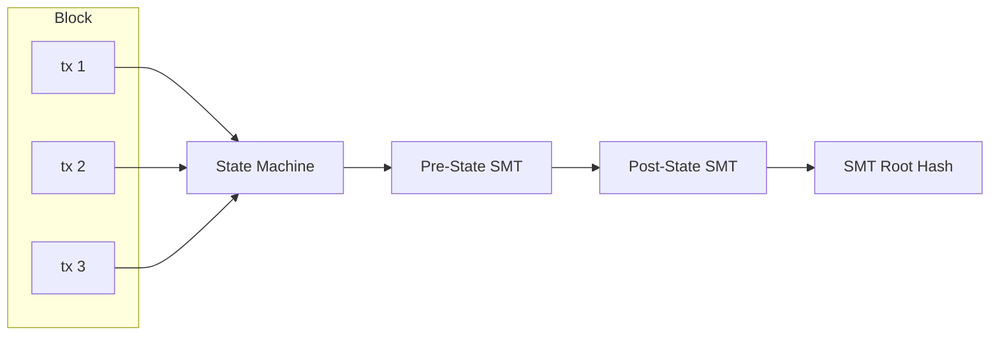

# Protocol

## Serialization

| Layer                                 | Format                     | Why                              |
| ------------------------------------- | -------------------------- | -------------------------------- |
| **Wire protocol** (blocks, tx, votes) | SCALE (parity-scale-codec) | Compact, fast, derive-based      |
| **State storage** (redb rows)         | SCALE                      | Same as wire — consistent        |
| **RPC** (API responses)               | JSON (serde)               | Human-readable, standard clients |

```rust
// One struct, both formats via dual derives
#[derive(Encode, Decode, Serialize, Deserialize)]
pub struct Transaction {
    pub sender: [u8; 32],
    pub nonce: u64,
    // ... fields derive both SCALE + JSON serialization
}
```

## State Model

Account-based (not UTXO). Addresses map directly to account objects. State is committed via a Sparse Merkle Tree (see [State Root](#state-root)).

```
Account {
    address: [u8; 32],
    balance: U256,
    nonce: u64,
    code_hash: Option<[u8; 32]>,  // for future smart contracts
}
```

## Transaction Types (V1)

1. **Transfer** — Move MONEX between accounts
2. **RegisterValidator** — Declare intent to validate (one-time, prerequisite for staking)
3. **Stake** — Lock MONEX to become/activate a validator (requires prior registration)
4. **RegisterAndStake** — Convenience: registers + stakes atomically for new validators
5. **Unstake** — Begin withdrawal from validator set (7-day cooldown)
6. **Burn** — Send MONEX to `0x00..00` (permanent destruction) or `0x00..01` (Cap-Refill sink). Flat fee 10 MOXX regardless of amount — incentivizes voluntary supply reduction.

## Transaction Format

All protocol signatures use **Falcon-512** (666 bytes).

### Envelope (common to all tx types)

```rust
struct Transaction {
    chain_id: u64,
    nonce: u64,
    sender: [u8; 32],
    fee: U256,
    body: TxBody,               // SCALE enum — 1 byte variant + type-specific fields
    signature: [u8; 666],       // over SCALE of (chain_id || nonce || sender || fee || body)
}
```

### TxBody Enum

```rust
enum TxBody {
    Transfer { recipient: [u8; 32], amount: U256 },
    RegisterValidator,                                    // just the variant, no extra fields
    Stake { validator: [u8; 32], amount: U256 },
    RegisterAndStake { validator: [u8; 32], amount: U256 },
    Unstake { validator: [u8; 32], amount: U256 },
    Burn { target: BurnTarget, amount: U256 },
}

enum BurnTarget {
    Permanent,   // 0x00..00
    CapRefill,   // 0x00..01
}
```

## Block Structure

```rust
struct Block {
    header: BlockHeader,
    body: BlockBody,
}

struct BlockHeader {
    height: u64,
    parent_hash: [u8; 32],
    state_root: [u8; 32],        // SMT root (single commitment over all namespaces → per-shard roots)
    tx_root: [u8; 32],           // BLAKE3 Merkle root of all transaction hashes
    timestamp: u64,
    proposer: [u8; 32],          // validator address — self-describing, no era context needed
    chain_id: u64,
}

struct BlockBody {
    transactions: Vec<Transaction>,  // SCALE vector (compact length prefix + items)
}
```

**Votes** are not included in the block. They are gossipped and stored independently in the `block_votes` database table. See [Storage](./Storage.md).

**tx_root** is a BLAKE3 Merkle tree over the individual BLAKE3 hashes of each transaction. The leaves are `blake3(SCALE(tx))` for each tx in order. This enables future light client proofs (prove a tx is in a block without the full block body).

Note: No block-level compression. Blocks are always serialized as raw SCALE bytes. Transport-layer compression (snappy) is handled by libp2p.

### Commit Vote

```rust
struct CommitVote {
    height: u64,
    block_hash: [u8; 32],
    validator: [u8; 32],
    signature: [u8; 666],       // Falcon-512 over SCALE(height || block_hash)
}
```

Votes are not included in blocks. They are gossipped on `mononium/votes/{chain_id}` and stored in the `block_votes` DB table keyed by height.

## State Root

The state root is computed via a **256-depth Sparse Merkle Tree** using **BLAKE3** as the hash function.

### Namespaces

The SMT uses a single tree with 3 namespaces:

| Prefix | Namespace  | Contents                                                                 |
| ------ | ---------- | ------------------------------------------------------------------------ |
| `0x00` | Accounts   | `Address → (balance: U256, nonce: u64, code_hash: Option<[u8;32]>)`      |
| `0x01` | Validators | `PublicKey → (stake: U256, status: u8)`                                  |
| `0x02` | Meta       | Chain-global state: height, era, active set hash, chain_id, total supply |

Namespacing is implemented via key prefixing: account keys are stored as `0x00 ++ address`, validator keys as `0x01 ++ pubkey`, meta keys as `0x02 ++ key_id`.

### Implementation

```rust
// mononium-rust-lib/src/crypto/trie.rs
pub trait Trie {
    fn get(&self, key: &[u8]) -> Option<Vec<u8>>;
    fn insert(&mut self, key: &[u8], value: Vec<u8>);
    fn root(&self) -> [u8; 32];
    fn prove(&self, key: &[u8]) -> MerkleProof;  // for future light clients
}
```

The SMT is a custom implementation in `mononium-rust-lib`. No external trie dependency. The implementation only needs insert, get, root, and prove for V1.

## State Transition



- Transactions are applied **in order** within a block
- Each tx is validated (signature, nonce, balance) before execution
- **Failed transactions:** skip-and-continue — the tx is skipped, but the **fee is still paid** (added to the block fee pool for pro-rata distribution). This prevents spam (failed txs still cost MONEX) while keeping block production resilient to individual tx failures.
- State root after block = SMT root committing to full state
- Re-execute any block → deterministic state

Fees, fee distribution, and anti-spam deposits are documented in [Fees](plans/V0.6.0/Fees.md).

Genesis format, loading, and token supply are documented in [Genesis](plans/V0.6.0/Genesis.md).

## Chain ID

Each network gets a unique chain ID to prevent replay attacks across networks:

| Network  | Chain ID |
| -------- | -------- |
| Localnet | 0        |
| Devnet   | 1        |
| Testnet  | 2        |
| Mainnet  | 3        |

---

**Related:** [Architecture](plans/V0.6.0/Architecture.md), [Consensus](plans/V0.6.0/Consensus.md), [Network](plans/V0.6.0/Network.md), [Fees](plans/V0.6.0/Fees.md), [Genesis](plans/V0.6.0/Genesis.md)
