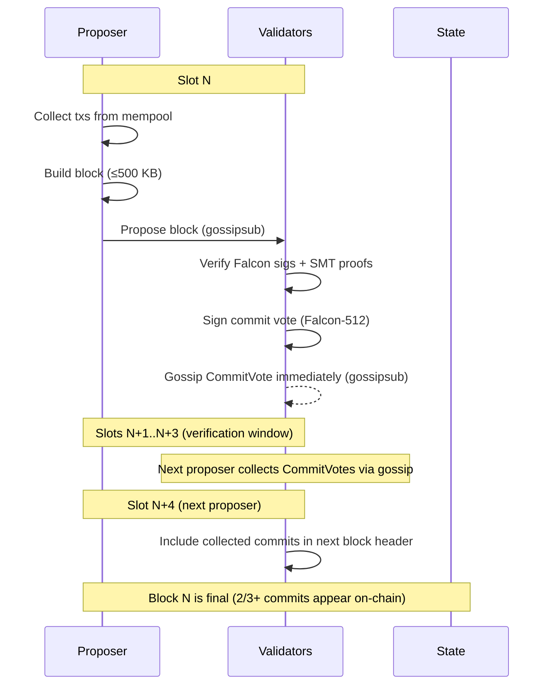

# Consensus

## Overview

Proof of Stake consensus with a fixed 5-second block time and 20-second finality.

## Parameters

| Parameter          | Value      | Notes                                 |
| ------------------ | ---------- | ------------------------------------- |
| Type               | PoS        |                                       |
| Block time         | 5s         | Fixed, not variable                   |
| Finality           | ~20s       | 4 blocks (BFT commit)                 |
| Block size         | 500 KB     | Hard cap                              |
| Finality mechanism | BFT commit | Per-block, 2/3+ validator sigs        |
| Era length         | 720 blocks | ~1 hour — validator set recalculation |

## Eras

An era is the period between **validator set recalculations**. Every N blocks, the election runs again.

```
Era boundary (block % 720 == 0):
  1. The proposer for block 720 snapshots the candidate pool
  2. Decrement `remaining_eras` for all frozen validators; thaw those reaching 0
  3. Runs ValidatorElection::elect() — frozen validators are excluded from the candidate pool
  4. Commits the new active set + updated freeze records to state as part of block 720
  5. Resets proposer schedule — validators update their local schedule after verifying block 720
  6. Block 721 is the first block produced under the new set
```

### Era 0 (Bootstrap)

The genesis state has **no validators** — the active set starts empty. A set of **bootstrap keys** designated in the genesis config are the only proposers for the first N blocks. Multiple keys eliminate the single point of failure — if one bootstrap node goes offline, another can continue producing blocks.

#### Bootstrap Phase

The genesis JSON defines a `bootstrap` field:

```json
{
  "bootstrap": {
    "public_keys": ["0x...", "0x..."],
    "blocks": 20
  }
}
```

- Block 1 launches the bootstrap phase. Only blocks from keys in `public_keys` are accepted.
- On each slot, any bootstrap key can propose; the scheduled proposer for that slot is determined by round-robin over the bootstrap key list (same algorithm as normal round-robin, just a smaller set).
- If a bootstrap key misses its slot, the slot goes empty (standard missed slot handling) — no pause or stall.
- Bootstrap proposers include txs from other validators (RegisterValidator, Stake) as they arrive.
- On mainnet, bootstrap proposers earn block rewards (CappedInflation) which fund their own registration fees.
- On dev tiers, genesis `accounts` supply the MONEX for registration fees.

#### Bootstrap Duration per Tier

| Tier     | Bootstrap blocks | Wall clock | Why                                             |
| -------- | :--------------: | :--------: | ----------------------------------------------- |
| Localnet |      **1**       |     5s     | Single key, proposal starts immediately         |
| Devnet   |      **20**      |    100s    | 3-5 validators register in under 2 minutes      |
| Testnet  |     **100**      |   ~8 min   | Community validators need a wider window        |
| Mainnet  |     **100**      |   ~8 min   | Same — bootstrap key + inflation handles launch |

#### End of Bootstrap Phase

When the bootstrap phase ends (block N+1), the bootstrap key runs the election:

1. Snapshot all registered validators from the bootstrap blocks
2. Commit them as era 0's active set (up to `max_validators`)
3. Normal round-robin proposer schedule begins
4. Bootstrap key has no special status — they participate as a regular validator if they registered

#### Era 0 Active Set

Once the election runs, all registered validators are automatically active (up to `max_validators`). No stake required — validators earn fees (and on mainnet, block rewards) to accumulate starting stake for era 1+.

#### Era 1+

Normal Top-N election takes over with a minimum 1 MONEX stake requirement.

```rust
pub enum ElectionMode {
    /// Era 0 only: no minimum stake
    Open,
    /// Era 1+: standard Top-N by stake
    TopN { max_validators: usize },
}
```

### What changes at era boundaries

| Element              | Changes? | Notes                     |
| -------------------- | -------- | ------------------------- |
| Active validator set | ✅ Yes   | New election result       |
| Proposer schedule    | ✅ Yes   | Resets with new set       |
| Block production     | ❌ No    | Continuous                |
| Mempool              | ❌ No    | Continuous                |
| Finality             | ❌ No    | Continuous                |
| Staking balances     | ❌ No    | Changes apply immediately |

## Finality: BFT Commit Per Block

After a block is proposed, validators verify and submit a signed commit vote. Once 2/3+ of the active set commits, the block is final.

```
slot 0: V1 proposes Block A → validators verify + vote immediately
slot 1-3: verification window (validators continue verifying and gossiping votes)
slot 4: V2 proposes Block B (includes any CommitVotes for Block A received via gossip) → A is final
```

- Validators **vote immediately** after they finish verifying — no waiting for slot boundaries or explicit requests
- The next proposer includes whatever CommitVotes they've collected via gossipsub during the verification window
- The proposer does **not** need to collect 2/3+ before proposing — they publish what they have; subsequent blocks accumulate additional votes
- **Verification window:** ~20s (4 blocks) — enough time for Falcon-512 verification (~10x slower than Ed25519) on cheap VPS hardware
- Commits are included in the _next_ block header as proof
- A block is final as soon as 2/3+ commits for it appear on-chain (via any later block's header)

## Flow



## Commit Format (Sketch)

```
CommitVote {
    block_hash: [u8; 32],
    validator: [u8; 32],       // validator address — self-describing
    signature: [u8; 666],      // Falcon-512
}
```

## Forks

Slashing is documented in a separate file: [Slashing](plans/V0.7.0/Slashing.md).

## Future: GRANDPA (V2.0+)

GRANDPA can be added as an alternative finality gadget via the same DI pattern. It finalizes many blocks at once, which is useful for larger validator sets or when network latency varies.

## Throughput

TPS is not a fixed target — it emerges from:

```
TPS ≈ block size / avg tx size / block time
```

With Falcon-512 signatures (666 bytes per tx), realistic tx sizes are larger than the original Ed25519 estimates:

| Tx Size | TPS (approx) |
| ------- | ------------ |
| 500 B   | ~200         |
| 800 B   | ~125         |
| 1 KB    | ~100         |
| 1.5 KB  | ~66          |

Realistic V1 throughput: **100-200 TPS** with Falcon-512 signatures, which aligns with the "Cheap Validators First" philosophy.

Mempool is documented in a separate file: [Mempool](plans/V0.7.0/Mempool.md).

## Validator Election

Validators are elected via **Top-N by stake** (see [Validators](Validators.md#Validator Election)). The election algorithm is swappable via dependency injection for future Phragmén support.

## Block Production

### V1: Round-Robin

Active validators take turns proposing blocks in a fixed order. The proposer schedule is deterministic:

```
slot 0: validator_1
slot 1: validator_2
slot 2: validator_3
slot 3: validator_4
slot 4: validator_1  (cycles)
...
```

- Order is determined at era boundaries (when active set is elected)
- All validators can compute the proposer for any slot independently
- **Frozen validators** (see [Slashing](plans/V0.7.0/Slashing.md#freeze-period)) are excluded from the schedule — the active set passed to `RoundRobin` filters out frozen entries
- Simple, predictable, easy to debug with Docker

### Future: VRF Leader Election (V2.0+)

Randomized proposer selection via Verifiable Random Function. Each validator runs VRF each slot; lowest output wins.

### Slot Model

Blocks and slots are **not equivalent**. Slots are time intervals (5s each); blocks are proposals that may or may not fill every slot.

**Option B (adopted): Height = blocks proposed, not slots**

```
slot  0: V1 proposes Block 10  ✓    → height 10
slot  1: V2 is offline               → empty slot, no height change
slot  2: V3 proposes Block 11  ✓    → height 11 (builds on Block 10)
slot  3: V4 proposes Block 12  ✓    → height 12
```

- Height increments only when a block is actually proposed
- Block N always builds on Block N-1
- Empty slots are transparent to the state machine

**Rejected — Option A (height = slot index):** Would create phantom state gaps

```
slot  0: Block 0
slot  1: (empty) → height 1 exists with no block → complicates sync + state queries
```

### Missed Slots

If the proposer for a slot is offline, the **slot goes empty**:

- After 5s (block time elapses) with no block from the expected proposer, validators do nothing
- No votes are cast (nothing to vote on)
- The next proposer in the round-robin schedule builds on the last canonical block
- Height increments only when a block is actually proposed

**0.08 MONEX flat penalty** per missed slot. Applied at era boundary during validator set reconciliation (not per-slot slashing — avoids mid-era consensus disputes). Penalty amount is sent to `0x00..01` (Cap-Refill address) — it expands the effective max supply rather than burning.

An inactive validator who accumulates penalties will naturally fall out of the Top-N by stake at the next era boundary.

### Clock Drift Tolerance

Each block includes a `timestamp` set by the proposer from their local wall clock. Validators verify this timestamp when receiving a block:

```
if abs(block.timestamp - local_wall_clock) > 2s → REJECT block
```

**Why ±2s:**

- Target hardware is cheap VPS with standard NTP — typical drift between syncs is <50ms
- ±2s provides generous slack for warm CPUs, Docker containers without `chronyd`, and VM scheduler jitter
- A drifted node's blocks will be rejected by the honest majority regardless; this is a polite rejection window, not a security boundary

**Effects of a drifted timestamp:**

- Rejected block → slot goes empty (same as offline proposer)
- Proposer pays the 0.08 MONEX missed slot penalty at era boundary
- If a node's clock consistently drifts beyond ±2s, all its proposals fail and its penalty accumulates. The node should log a warning: `Clock drift exceeds ±2s — verify NTP configuration`

**Implementation:**

- `block.timestamp` is a `u64` Unix timestamp (seconds since epoch, not milliseconds — second granularity is sufficient for 5s slots)
- Validation is purely local: each validator compares against their own clock
- Timestamps must be monotonic within the chain: `block.timestamp >= parent_block.timestamp` (enforced by parent_hash ordering — can't build on a future block)
- No global slot-zero coordination is needed — validators reject implausible timestamps independently

### DI Pattern

Same trait-based approach as [Validators](Validators.md#Validator Election):

```rust
#[async_trait]
pub trait ProposerSelection: Send + Sync {
    fn select_proposer(&self, slot: u64, active_set: &[ValidatorId]) -> ValidatorId;
}

pub struct RoundRobin;
impl ProposerSelection for RoundRobin {
    fn select_proposer(&self, slot: u64, active_set: &[ValidatorId]) -> ValidatorId {
        active_set[slot as usize % active_set.len()]
    }
}
```

```rust
ConsensusConfig {
    election: Box::new(TopNElection),
    proposer: Box::new(RoundRobin),
    block_time: Duration::from_secs(5),
    epoch_length: 720,
}
```

## Consensus Overhead Includes

- Message propagation
- Falcon-512 signature verification (batch where possible)
- State validation per block (SMT verification)

## Fork Handling

### Design Principle

V1 has no explicit fork-choice rule beyond **following the proposer schedule**. Fork resolution emerges naturally from slot timing and slashing economics.

### Temporary Partition (no BFT commit on either side)

The partition heals and validators see two chains of equal length from the same parent. Resolution:

1. Each validator follows the block from the **scheduled proposer** for each slot
2. If the scheduled proposer didn't produce (missed slot), the slot moves on
3. One side will eventually have more scheduled proposers than the other and naturally become the heavier chain
4. Validators on the shorter chain sync to the longer one at the next opportunity

### BFT Equivocation Fork (2/3+ commits on both sides)

Validators who signed both competing blocks are **equivocating** and get slashed 90% of their stake. Resolution:

1. Whichever chain has more **total validator stake backing it** is canonical
2. Since equivocators lose 90% stake, the honest chain becomes heavier immediately
3. Validators on the lighter chain switch to the heavier one, accepting the fork
4. The equivocators' stake on the losing chain is also slashed (they lose either way)

### Implementation

```rust
// No special ForkChoice trait in V1.
// Validators use the heaviest-by-stake rule:
fn select_canonical(chain_a: &ChainState, chain_b: &ChainState) -> ChainId {
    if chain_a.total_stake_weight > chain_b.total_stake_weight {
        chain_a
    } else {
        chain_b
    }
}
```

### Future (V2+)

If VRF leader election or GRANDPA finality is added, explicit fork-choice rules (e.g., GHOST) may replace this simple approach.

## Attack Resistance

- **Nothing at stake**: Addressed via slashing (90% equivocation penalty)
- **Long-range attack**: To be addressed (key-evolving signatures or checkpointing)
- **Censorship**: Multiple proposers via round-robin or VRF selection

---

**Related:** [Validators](plans/V0.7.0/Validators.md), [Protocol](plans/V0.7.0/Protocol.md), [Slashing](plans/V0.7.0/Slashing.md), [Mempool](plans/V0.7.0/Mempool.md), [ADR-017](../../architecture/ADR-017-slashing-freeze.md)
