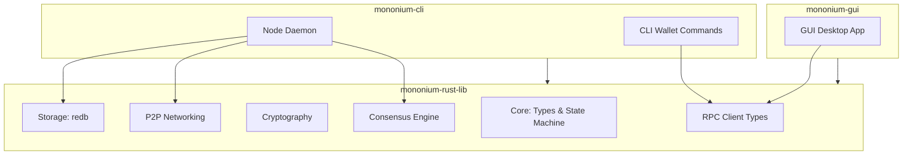

# Architecture

## Cargo Workspace

Mononium is a **Cargo workspace** with three crates:

```
mononium/
├── Cargo.toml              # workspace root
├── mononium-rust-lib/      # core library (all shared logic)
├── mononium-cli/           # CLI binary (node + wallet)
└── mononium-gui/           # GUI binary (desktop app)
```

## Crate Overview



## mononium-rust-lib

The shared library that both CLI and GUI depend on. Contains all blockchain logic:

```
mononium-rust-lib/src/
├── lib.rs                    # re-exports, crate-level types
├── constants.rs              # Shared constants (chain-wide protocol values)
├── core/
│   ├── mod.rs
│   ├── constants.rs          # Core-specific constants (U256 precision, etc.)
│   ├── account.rs            # Account struct, Address type
│   ├── transaction.rs        # Transaction, TransactionType enum
│   ├── block.rs              # Block, BlockHeader, CommitVote
│   ├── state.rs              # StateMachine (apply_tx, apply_block)
│   └── fee.rs                # FeePolicy trait, HybridFee impl
├── crypto/
│   ├── mod.rs
│   ├── constants.rs          # Crypto constants (key/sig sizes, etc.)
│   ├── signature.rs          # SignatureScheme trait
│   ├── falcon.rs             # Falcon512 impl (wraps falcon crate)
│   ├── hash.rs               # BLAKE3 wrappers
│   ├── trie.rs               # SMT: insert, get, root, prove
│   └── address.rs            # Address derivation, format, checksum
├── consensus/
│   ├── mod.rs                # ConsensusEngine, ConsensusConfig
│   ├── constants.rs          # Consensus constants (block time, era length, etc.)
│   ├── election.rs           # ValidatorElection trait, TopNElection
│   ├── proposer.rs           # ProposerSelection trait, RoundRobin
│   ├── era.rs                # Era calculation, ElectionMode
│   ├── finality.rs           # BFT commit tracking
│   ├── slashing.rs           # Evidence types, slash logic (90% + bounty + 72-era freeze)
│   └── supply.rs             # SupplyPolicy trait, FixedSupply
├── config/
│   ├── mod.rs                # Config struct, load (YAML + TOML), merge with CLI
│   └── constants.rs          # Default ports, paths, field bounds
├── mempool/
│   ├── mod.rs                # Mempool struct, insert/remove/select
│   ├── constants.rs          # Mempool constants (max_size, ttl, min_fee)
│   └── ordering.rs           # Tip → Time → Nonce ordering
├── storage/
│   ├── mod.rs                # StorageEngine trait
│   ├── constants.rs          # Storage constants (table names, etc.)
│   ├── redb.rs               # RedbEngine impl
│   ├── tables.rs             # Table definitions (accounts, validators, blocks, etc.)
│   └── genesis.rs            # Genesis loading from JSON
├── network/
│   ├── mod.rs                # P2pService, start/stop
│   ├── constants.rs          # Network constants (topics, default ports, etc.)
│   ├── topics.rs             # Topic constants, message types per topic
│   ├── discovery.rs          # Bootstrap + kademlia peer discovery
│   └── messages.rs           # Wire message types (SCALE encode/decode)
├── governance/
│   ├── mod.rs                # GovernanceEngine, proposal/vote processing
│   ├── constants.rs          # Governance constants (window, deposit, rate limits)
│   └── types.rs              # Proposal, Vote, GovernanceAction, GovernanceParam types
└── rpc/
    ├── mod.rs                # Combined RPC service
    ├── constants.rs          # RPC constants (port numbers, route paths)
    ├── jsonrpc.rs            # jsonrpsee server setup
    ├── rest.rs               # axum REST routes
    └── types.rs              # RPC response types (JSON serde)
```

| Module        | Responsibility                                                      |
| ------------- | ------------------------------------------------------------------- |
| `core/`       | Account types, U256, state machine, tx processing                   |
| `consensus/`  | PoS consensus engine                                                |
| `governance/` | On-chain voting, proposal lifecycle, parameter mutation             |
| `mempool/`    | Transaction pool (tip → time → nonce ordering)                      |
| `config/`     | Node config load/merge (YAML + TOML), CLI flag binding              |
| `crypto/`     | Falcon-512 signing/verification, BLAKE3 hashing, Sparse Merkle Trie |
| `storage/`    | redb database (mutable + append-only tables, StorageEngine trait)   |
| `network/`    | P2P networking, peer discovery, message gossip                      |
| `rpc/`        | RPC server (jsonrpsee + REST) and client types                      |

## mononium-cli

The CLI binary. Has two roles:

- **Node daemon** — runs the validator, participates in consensus, maintains state
- **CLI wallet** — key generation (Falcon-512), tx signing, balance queries via RPC

```
mononium-cli
├── node          # start the node daemon
├── wallet        # wallet commands
│   ├── keygen    # generate Falcon-512 keys
│   ├── balance   # query balance
│   ├── transfer  # send MONEX
│   └── stake     # stake/unstake
├── query         # chain queries (block, tx, validator set)
└── logfmt        # convert JSON logs to human-readable text (pipe from stdin)
```

## mononium-gui

Desktop GUI application for wallets, block exploration, and network monitoring. Built on `mononium-rust-lib`. Connects to a running node via RPC — does not run a node itself.

## RPC Interface

Hybrid: **REST (axum) for reads + mutations**, **jsonrpsee (WebSocket) for subscriptions**.
REST is the primary transport in Phase 1 (simpler, curl-friendly); jsonrpsee is added alongside in Phase 2.

### REST (axum — HTTP)

| Method | Path                   | Returns                     | Phase |
| ------ | ---------------------- | --------------------------- | ----- |
| POST   | `/tx`                  | `TxHash`                    | 1     |
| GET    | `/tx/{hash}`           | `TxStatus`                  | 1     |
| GET    | `/block/{height}`      | `Block`                     | 1     |
| GET    | `/block/{hash}`        | `Block`                     | 1     |
| GET    | `/block/latest`        | `BlockHeader`               | 1     |
| GET    | `/balance/{address}`   | `U256` (MOXX)               | 1     |
| GET    | `/nonce/{address}`     | `u64`                       | 1     |
| GET    | `/validators`          | `Vec<ValidatorInfo>`        | 1     |
| GET    | `/validator/{address}` | `ValidatorInfo`             | 1     |
| GET    | `/era`                 | `u64`                       | 1     |
| GET    | `/height`              | `u64`                       | 1     |
| GET    | `/genesis`             | `Hash`                      | 1     |
| GET    | `/health`              | `{ status, height, peers }` | 1     |

- Phase 1: single-node prototype with REST only
- Phase 2: jsonrpsee added for subscriptions (see below)
- Request/response bodies are JSON (serde)
- Error responses: `{ "error": { "code": int, "message": string } }` with HTTP status codes (400, 404, 500)

### JSON-RPC (jsonrpsee — WebSocket)

Available from Phase 2 onward. Complements REST with subscriptions and batched requests.

| Method               | Params                            | Returns                       | Notes                            |
| -------------------- | --------------------------------- | ----------------------------- | -------------------------------- |
| `tx_submit`          | `Transaction` (SCALE-hex encoded) | `TxHash`                      | Submit signed transaction        |
| `tx_status`          | `TxHash`                          | `{ status, height?, index? }` | Pending / finalized / failed     |
| `block_get`          | `BlockId` (height or hash)        | `Block`                       | Full block with body             |
| `block_header`       | `BlockId`                         | `BlockHeader`                 | Header only (lighter than block) |
| `block_latest`       | —                                 | `BlockHeader`                 | Latest header                    |
| `state_get_balance`  | `Address`                         | `U256`                        | Balance in MOXX                  |
| `state_get_nonce`    | `Address`                         | `u64`                         | Next valid nonce                 |
| `validator_set`      | —                                 | `Vec<ValidatorInfo>`          | Active + candidate set           |
| `validator_stake`    | `Address`                         | `U256`                        | Stake of specific validator      |
| `era_current`        | —                                 | `u64`                         | Current era index                |
| `chain_get_height`   | —                                 | `u64`                         | Current block height             |
| `chain_get_genesis`  | —                                 | `Hash`                        | Genesis block hash               |
| `subscribe_blocks`   | —                                 | `Event<BlockHeader>`          | New block notifications          |
| `subscribe_finality` | —                                 | `Event<FinalityEvent>`        | Finality notifications           |
| `subscribe_votes`    | —                                 | `Event<CommitVote>`           | Vote notifications               |

**Error codes:**

| Code | Meaning              |
| ---- | -------------------- |
| 0    | Success              |
| -1   | Internal error       |
| -2   | Invalid params       |
| -3   | Tx validation failed |
| -4   | Block not found      |
| -5   | Tx not found         |
| -6   | Address not found    |
| -7   | Rate limited         |

### CLI Usage

```bash
# REST
mononium-cli wallet balance 0x...          # POST /tx then GET /balance/0x...
mononium-cli query block 42               # GET /block/42
mononium-cli query tx <hash>              # GET /tx/{hash}
mononium-cli query validators             # GET /validators
mononium-cli query health                 # GET /health

# JSON-RPC (Phase 2+)
mononium-cli wallet transfer 0x... 100    # tx_submit via jsonrpsee
mononium-cli node                          # starts both REST + WebSocket servers
```

## State Model

- **Account-based** (not UTXO)
- Balances stored as `U256`
- 32 decimal places (10^32 MOXX per MONEX)
- Deterministic state transitions — same input → same output
- State committed via **256-depth Sparse Merkle Tree** (BLAKE3)

## Key Decisions

| Decision          | Rationale                                 |
| ----------------- | ----------------------------------------- |
| Rust              | Safety, performance, ecosystem            |
| Account model     | Simpler than UTXO for V1                  |
| Embedded DB       | redb — pure Rust, ACID, memory-mapped     |
| 3-crate workspace | Clean separation: lib shared by CLI + GUI |
| CLI-first         | Node + wallet shipped first; GUI follows  |

## Design Patterns

### Validator Election DI

The validator election algorithm is swappable via a trait + injection pattern in `mononium-rust-lib`:

```rust
// mononium-rust-lib/src/consensus/election.rs

/// Pluggable validator election strategy
#[async_trait]
pub trait ValidatorElection: Send + Sync {
    /// Select the active validator set from all candidates
    async fn elect(&self, candidates: &[ValidatorCandidate], max: usize) -> Vec<ValidatorId>;
}

// V1: Simple top-N by stake
pub struct TopNElection;

#[async_trait]
impl ValidatorElection for TopNElection {
    async fn elect(&self, candidates: &[ValidatorCandidate], max: usize) -> Vec<ValidatorId> {
        let mut sorted = candidates.to_vec();
        sorted.sort_by(|a, b| b.total_stake.cmp(&a.total_stake));
        sorted.into_iter().take(max).map(|c| c.id).collect()
    }
}

// Future: Phragmén election (separate module)
pub struct PhragmenElection;
```

The consensus engine takes `Box<dyn ValidatorElection>` at construction time, making the algorithm trivially swappable.

```rust
// mononium-rust-lib/src/consensus/mod.rs
pub struct ConsensusConfig {
    pub election: Box<dyn ValidatorElection>,
    pub block_time: Duration,
    pub epoch_length: u64,
}
```

The CLI config injects the concrete implementation:

```rust
// mononium-cli uses TopNElection
ConsensusConfig {
    election: Box::new(TopNElection),
    ...
}
```

## Node Startup Lifecycle

When `mononium-cli node` is invoked, the initialization follows this ordered sequence:

```
 1. Parse CLI args (clap) — identify --config path if present
 2. Load config file — resolve via search order (see [NodeConfig](./NodeConfig.md))
 3. Merge settings — CLI flags override config file override defaults
 4. Load key metadata — read ~/.mononium/keys/{name}.json, identify validator address
 5. Prompt for passphrase — enter to unlock the encrypted seed
 6. Derive key — Argon2id (256 MiB, 16 iterations, configurable via `crypto.*` settings) → NaCl secretbox decrypt → re-derive Falcon-512 private key
 7. **[y/N] confirmation prompt** — show startup preview, ask user to confirm before proceeding
 8. Open/init redb database — at {data_dir}/{chain_id}/
 9. If no DB exists → load genesis JSON → build initial SMT → write genesis block (height 0)
10. Load state from DB — current height, SMT root, validator set, era index
11. Start libp2p host — bind P2P port, subscribe to 4 gossipsub topics
12. Connect to bootstrap peers — kademlia discovers additional peers on same chain_id
13. Initialize consensus engine — compute proposer schedule for current era
14. Start slot timer — begin listening for block production / voting slots
15. Start RPC servers — axum (REST) on rest_port (Phase 1). jsonrpsee (WebSocket) on rpc_port added in Phase 2 via config flag.
16. Register signal handlers — SIGINT/SIGTERM → graceful shutdown
```

### Startup Preview

Step 5 displays a summary before the node commits to anything:

```
Mononium Node — Startup Preview
  Network:     Devnet (chain ID: 1)
  Validator:   0x3a1b...checksum
  P2P port:    30333
  Boot peers:  3
  Data dir:    ~/.mononium/data/devnet/

Start node? [y/N]
```

If the user answers N, the process exits cleanly. This prevents accidentally running the wrong key on the wrong network.

## Crash Recovery

If the node crashes, recovery is handled automatically on next startup:

```
On restart:
  1. Open redb, read current height from meta table
  2. Load the latest canonical block from blocks table
  3. Recompute SMT root from stored state
  4. If consistent → resume from next height
  5. If inconsistent → panic (should not happen — redb write transactions are ACID)
```

**Key guarantee:** redb write transactions are fully atomic. If the process dies mid-`apply_block`, the entire write transaction rolls back. The node restarts at the previous canonical height.

**Missed blocks:** After recovery, the node discovers missed blocks via the sync protocol — it sends `RequestBlocks { from_height, to_height }` to peers and receives `BlockResponse { blocks }` in return. Blocks are validated and applied in order.

### State Checkpoints

Full state snapshots are taken at every **era boundary** (720 blocks, ~1 hour). The snapshot is written to redb in a **background task** — block production continues without blocking. See [Storage — Checkpoints](./plans/V0.8.0/Storage.md) for the full protocol, retention policy, size estimates, and implementation details.

## Dependency Flow

```
mononium-rust-lib     ← no workspace deps (external crates only)
mononium-cli          → depends on mononium-rust-lib
mononium-gui          → depends on mononium-rust-lib
```

No circular dependencies. The lib has zero knowledge of CLI or GUI — it's pure blockchain logic.

---

**Related:** [Protocol](plans/V0.8.0/Protocol.md), [Storage](plans/V0.8.0/Storage.md), [Validators](plans/V0.8.0/Validators.md), [Roadmap](plans/V0.8.0/Roadmap.md)
