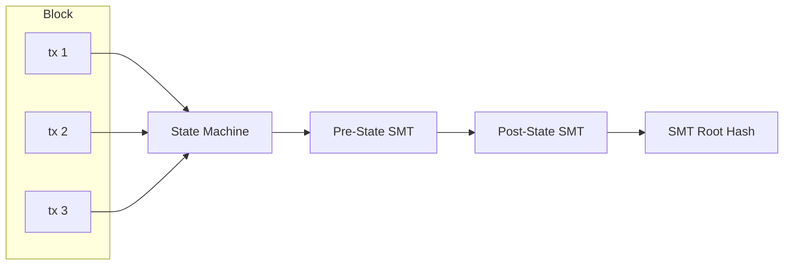

# Protocol

## Serialization

| Layer                                 | Format                     | Why                              |
| ------------------------------------- | -------------------------- | -------------------------------- |
| **Wire protocol** (blocks, tx, votes) | SCALE (parity-scale-codec) | Compact, fast, derive-based      |
| **State storage** (redb rows)         | SCALE                      | Same as wire — consistent        |
| **RPC** (API responses)               | JSON (serde)               | Human-readable, standard clients |

```rust
// One struct, both formats via dual derives
#[derive(Encode, Decode, Serialize, Deserialize)]
pub struct Transaction {
    pub sender: [u8; 32],
    pub nonce: u64,
    // ... fields derive both SCALE + JSON serialization
}
```

### SCALE Enum Encoding

All protocol enums (`TxBody`, `BurnTarget`, `TransactionType`, etc.) use standard SCALE enum encoding:

- **SCALE:** The variant is encoded as a `u8` tag (0-indexed, in declaration order) followed by the variant's fields concatenated. Unit variants (no fields) encode as just the tag byte.
  - Example: `TxBody::Burn { target: Permanent, amount: 100 }` → `0x05` (tag 5) ++ `0x00` (BurnTarget::Permanent tag) ++ SCALE(U256(100))
- **JSON:** Standard serde adjacently-tagged enum representation: `{ "variant_name": { ...fields } }`

All protocol types derive both `Encode`/`Decode` (from `parity-scale-codec`) and `Serialize`/`Deserialize` (from `serde`).

## State Model

Account-based (not UTXO). Addresses map directly to account objects. State is committed via a Sparse Merkle Tree (see [State Root](#state-root)).

```
Account {
    address: [u8; 32],
    balance: U256,
    nonce: u64,
    code_hash: Option<[u8; 32]>,  // for future smart contracts
}
```

## Transaction Types (V1)

1. **Transfer** — Move MONEX between accounts
2. **RegisterValidator** — Declare intent to validate (one-time, prerequisite for staking)
3. **Stake** — Lock MONEX to become/activate a validator (requires prior registration)
4. **RegisterAndStake** — Convenience: registers + stakes atomically for new validators
5. **Unstake** — Begin withdrawal from validator set (168-era cooldown)
6. **Burn** — Send MONEX to `0x00..00` (permanent destruction) or `0x00..01` (Cap-Refill sink). Flat fee 10 MOXX regardless of amount — incentivizes voluntary supply reduction.

## Transaction Format

All protocol signatures use **Falcon-512** (666 bytes).

### Envelope (common to all tx types)

```rust
struct Transaction {
    chain_id: u64,
    nonce: u64,
    sender: [u8; 32],
    fee: U256,
    body: TxBody,               // SCALE enum — 1 byte variant + type-specific fields
    signature: [u8; 666],       // over SCALE of (chain_id || nonce || sender || fee || body)
}
```

### TxBody Enum

```rust
enum TxBody {
    Transfer { recipient: [u8; 32], amount: U256 },
    RegisterValidator,                                    // just the variant, no extra fields
    Stake { validator: [u8; 32], amount: U256 },
    RegisterAndStake { validator: [u8; 32], amount: U256 },
    Unstake { validator: [u8; 32], amount: U256 },
    Burn { target: BurnTarget, amount: U256 },
}

enum BurnTarget {
    Permanent,   // 0x00..00
    CapRefill,   // 0x00..01
}
```

## Block Structure

```rust
struct Block {
    header: BlockHeader,
    body: BlockBody,
}

struct BlockHeader {
    height: u64,
    parent_hash: [u8; 32],
    global_state_root: [u8; 32], // Merkle root of per-shard SMT roots (see StateSharding.md)
    tx_root: [u8; 32],           // BLAKE3 Merkle root of all transaction hashes
    timestamp: u64,
    proposer: [u8; 32],          // validator address — self-describing, no era context needed
    chain_id: u64,
}

struct BlockBody {
    transactions: Vec<Transaction>,  // SCALE vector (compact length prefix + items)
}
```

**Votes** are not included in the block. They are gossipped and stored independently in the `block_votes` database table. See [Storage](./Storage.md).

**tx_root** is a BLAKE3 Merkle tree over the individual BLAKE3 hashes of each transaction. The leaves are `blake3(SCALE(tx))` for each tx in order. This enables future light client proofs (prove a tx is in a block without the full block body).

Note: No block-level compression. Blocks are always serialized as raw SCALE bytes. Transport-layer compression (snappy) is handled by libp2p.

### Commit Vote

```rust
struct CommitVote {
    height: u64,
    block_hash: [u8; 32],
    validator: [u8; 32],
    signature: [u8; 666],       // Falcon-512 over SCALE(height || block_hash)
}
```

Votes are not included in blocks. They are gossipped on `mononium/votes/{chain_id}` and stored in the `block_votes` DB table keyed by height.

## State Root

The state root is computed via a **256-depth Sparse Merkle Tree** using **BLAKE3** as the hash function.

### Namespaces

The SMT uses a single tree with 3 namespaces:

| Prefix | Namespace  | Contents                                                                                                                      |
| ------ | ---------- | ----------------------------------------------------------------------------------------------------------------------------- |
| `0x00` | Accounts   | `Address → (balance: U256, nonce: u64, code_hash: Option<[u8;32]>)`                                                           |
| `0x01` | Validators | `PublicKey → (stake: U256, status: u8, frozen_until: u64)` — `status`: `0` = Staked, `1` = Active, `2` = Frozen, `3` = Thawed |
| `0x02` | Meta       | Chain-global state: height, era, active set hash, chain_id, total supply                                                      |

Namespacing is implemented via key prefixing: account keys are stored as `0x00 ++ address`, validator keys as `0x01 ++ pubkey`, meta keys as `0x02 ++ key_id`.

Validator status values:

| Value | Status | Meaning                                                                                                 |
| ----- | ------ | ------------------------------------------------------------------------------------------------------- |
| `0`   | Staked | Candidate in pool, not currently in active set                                                          |
| `1`   | Active | In the active validator set, proposing and voting                                                       |
| `2`   | Frozen | Slashed — excluded from active set for 72 eras (see [Slashing](plans/V0.8.0/Slashing.md#freeze-period)) |
| `3`   | Thawed | Freeze expired, re-entered candidate pool with remaining stake                                          |

`frozen_until` is the era number at which the validator thaws. Set at slashing time to `current_era + 72` and checked at era boundaries. Non-frozen validators (status ≠ 2) have `frozen_until = 0`.

### Implementation

```rust
// mononium-rust-lib/src/crypto/trie.rs
pub trait Trie {
    fn get(&self, key: &[u8]) -> Option<Vec<u8>>;
    fn insert(&mut self, key: &[u8], value: Vec<u8>);
    fn root(&self) -> [u8; 32];
    fn prove(&self, key: &[u8]) -> MerkleProof;  // for future light clients
}
```

The SMT is a custom implementation in `mononium-rust-lib`. No external trie dependency. The implementation only needs insert, get, root, and prove for V1.

## State Transition



### Block Application Order (Exact)

When a node applies a block, these steps execute in strict sequence:

```
1. VALIDATE HEADER
   a. Verify parent_hash exists in canonical chain
   b. Verify timestamp ±2s of local clock
   c. Verify proposer is scheduled proposer for this slot
   d. Verify block size ≤ 500 KB (SCALE bytes)

2. INITIALIZE BLOCK STATE
   a. Set block_fees = 0
   b. Copy pre-state SMT root from parent block

3. APPLY TRANSACTIONS (in order)
   For each tx in block.body.transactions:
   a. Verify Falcon-512 signature over (chain_id || nonce || sender || fee || body)
   b. Verify nonce matches sender's current nonce
   c. Verify sender has sufficient balance for fee + deposit
   d. If any check fails → skip tx (do not execute), but still:
      - Deduct fee from sender's balance (failed txs still pay)
      - Add fee to block_fees pool
      - Continue to next tx
   e. If all checks pass:
      - Deduct fee from sender's balance
      - Deduct 0.33 MONEX anti-spam deposit (held until era N+2)
      - Execute tx body (transfer, stake, burn, etc.)
      - Increment sender's nonce
      - Add fee to block_fees pool

4. DISTRIBUTE FEES (end of block, after all txs)
   a. Compute total_active_stake = sum of all active validators' stake
   b. For each active validator V with stake S_V:
      V.balance += block_fees * S_V / total_active_stake
   c. Distribute remainder (integer truncation) to validator with:
      lowest address among highest-stake validators

5. COMMIT STATE
   a. Compute new per-shard SMT roots from updated state
   b. Compute global_state_root = root_of([shard_0_root, shard_1_root, ...])
   c. Assert computed_global_state_root == block.header.global_state_root
      (execution node — proposer already committed this root; verify it matches)

6. STORE BLOCK
   a. Write block to blocks table (header + metadata)
   b. Write each tx to tx_body table (height, index)
   c. Write tx hash → location to tx_lookup table
   d. Emit new-block event (tracing, RPC broadcast)
```

- Transactions are applied **in order** within a block
- **Failed transactions:** skip-and-continue — the tx is skipped, but the **fee is still paid** (added to the block fee pool for pro-rata distribution). This prevents spam (failed txs still cost MONEX) while keeping block production resilient to individual tx failures.
- State root after block = SMT root committing to full state
- Re-execute any block → deterministic state

Fees, fee distribution, and anti-spam deposits are documented in [Fees](plans/V0.8.0/Fees.md).

Genesis format, loading, and token supply are documented in [Genesis](plans/V0.8.0/Genesis.md).

## Chain ID

Each network gets a unique chain ID to prevent replay attacks across networks:

| Network  | Chain ID |
| -------- | -------- |
| Localnet | 0        |
| Devnet   | 1        |
| Testnet  | 2        |
| Mainnet  | 3        |

---

## Internal Error Types

The library uses a unified `LibError` enum (with `thiserror`) for all internal error paths:

```rust
#[derive(Debug, thiserror::Error)]
pub enum LibError {
    #[error("invalid signature")]
    InvalidSignature,
    #[error("insufficient balance: have {0}, need {1}")]
    InsufficientBalance(U256, U256),
    #[error("invalid nonce: expected {0}, got {1}")]
    InvalidNonce(u64, u64),
    #[error("account not found: {0}")]
    AccountNotFound([u8; 32]),
    #[error("validator not found: {0}")]
    ValidatorNotFound([u8; 32]),
    #[error("block not found: {0}")]
    BlockNotFound(u64),
    #[error("tx not found")]
    TxNotFound,
    #[error("proposal not found")]
    ProposalNotFound,
    #[error("governance action rejected: {0}")]
    GovernanceRejected(&'static str),
    #[error("storage error: {0}")]
    Storage(#[from] redb::Error),
    #[error("serialization error: {0}")]
    Codec(#[from] parity_scale_codec::Error),
    #[error("consensus error: {0}")]
    Consensus(&'static str),
    #[error("network error: {0}")]
    Network(String),
}

// CLI uses anyhow for top-level error handling, wrapping LibError
```

The CLI binary wraps `LibError` into `anyhow::Error` for user-facing messages. The GUI uses `LibError` directly since it handles errors in its own UI layer.

**Related:** [Architecture](plans/V0.8.0/Architecture.md), [Consensus](plans/V0.8.0/Consensus.md), [Network](plans/V0.8.0/Network.md), [Fees](plans/V0.8.0/Fees.md), [Genesis](plans/V0.8.0/Genesis.md)
