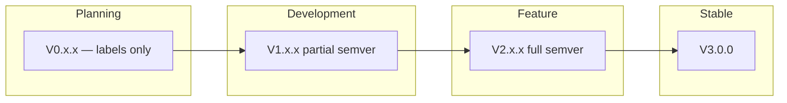

# Versioning

## Planning Phase (V0.x.x — no semver)

V0 directory names are **just labels** — they don't follow semver. They're bucket names for planning iterations.

```
docs/plans/V0.0.0/    ← first draft of the plan
docs/plans/V0.1.0/    ← next revision (if needed)
```

No breaking/feature/patch semantics. These are just names to organize plan versions.

## Development Phase (V2.x.x+ — semver)

Once development starts, real **Semantic Versioning** applies: `V[Breaking].[Feature].[Patch]`

| Segment      | Meaning                                   |
| ------------ | ----------------------------------------- |
| **Breaking** | Incompatible changes                      |
| **Feature**  | New capabilities (non-breaking)           |
| **Patch**    | Fixes, polish, docs (backward compatible) |

## Phase Map



| Range               | Phase          | Semver?        | What It Means                                  |
| ------------------- | -------------- | -------------- | ---------------------------------------------- |
| **V0.x.x**          | 🧠 Planning    | ❌ Just labels | Docs, designs, specs. No production code.      |
| **V1.0.0 → V2.0.0** | 🔨 Development | ✅ Partial     | Building the chain. Breaking changes expected. |
| **V2.0.0 → V3.0.0** | 🔨 Feature completion | ✅ Yes         | Adding remaining features before stable. Breaking changes expected. |
| **V3.0.0+**         | 🚀 Stable      | ✅ Yes         | First stable mainnet release.                  |

## Dev Versions (V1.0.0 → V3.0.0)

- **V1.0.0-alpha** — First code written. Core lib skeleton.
- **V1.0.0-beta** — CLI node runs locally.
- **V1.1.0** — Multi-validator localnet.
- **V1.2.0** — Public devnet.
- **...**
- **V2.0.0** — Feature completion phase (full semver, remaining features).
- **V2.x.x** — Additional features, benchmarks, optimisation.
- **V3.0.0** — Mainnet launch. First stable.

## Release Checklist (V3.0.0 target)

- [ ] All planning docs finalized
- [ ] mononium-rust-lib: all core modules complete
- [ ] mononium-cli: node + wallet stable
- [ ] mononium-gui: v1 release
- [ ] Public mainnet running
- [ ] Security review passed
- [ ] 90%+ test coverage on core modules
